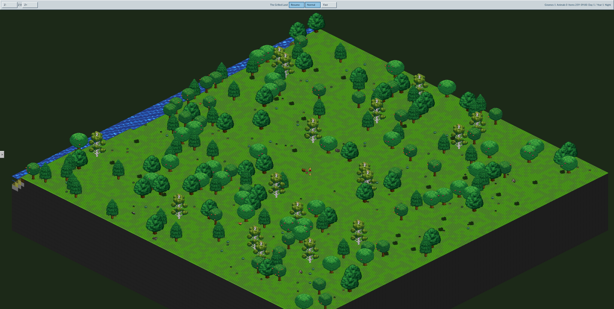
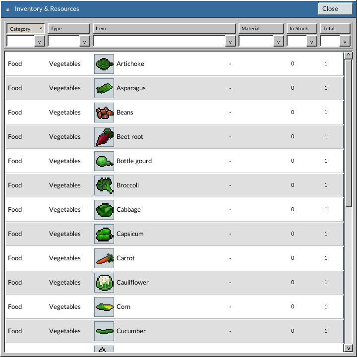
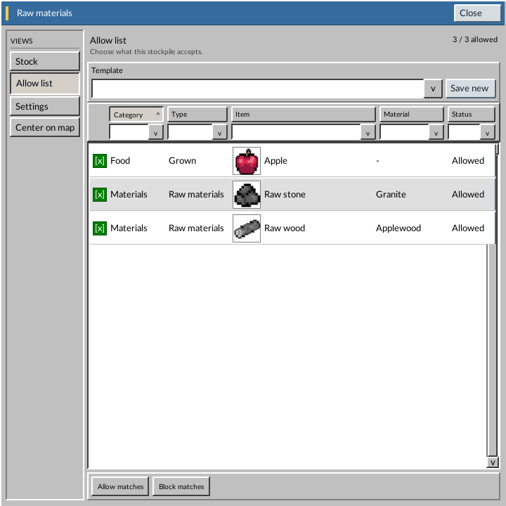
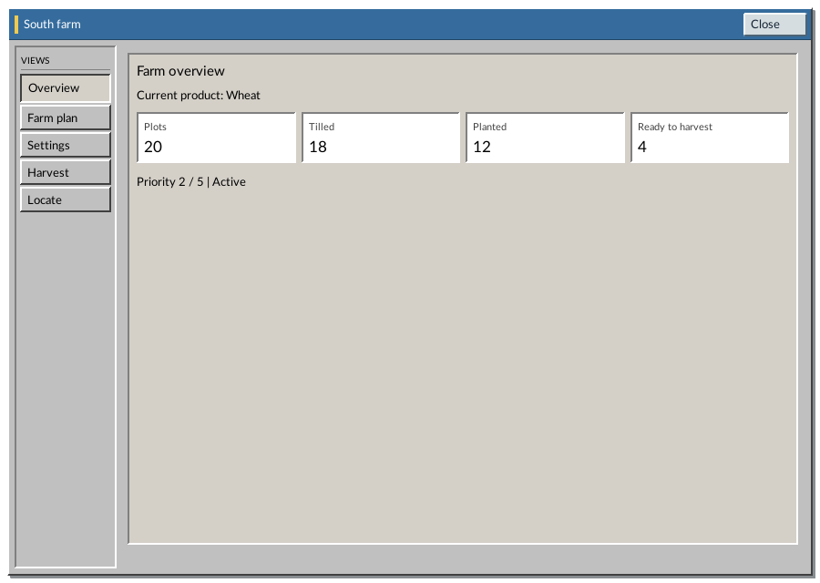
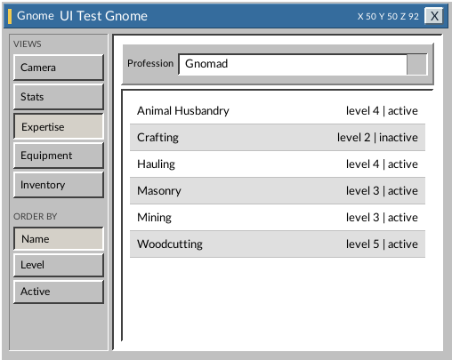
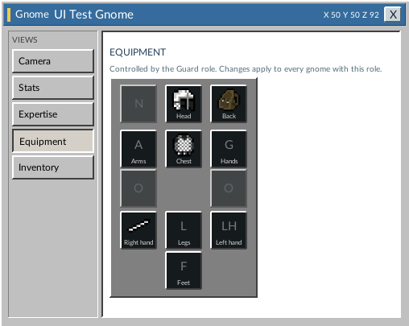
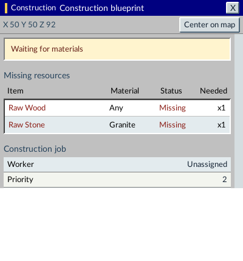

# Ingnomia

Ingnomia is a colony-management game inspired by [Gnomoria](https://store.steampowered.com/app/224500/Gnomoria/). This community fork builds on the original game by **Ralph Schurade (@rschurade)** and focuses primarily on a refreshed, more cohesive interface.

## Screenshots

The world image is from a fresh game generated with the current build's default world settings. The UI panels use deterministic demo data, not a player's save, so they show current screens with useful example content.

### Game world

*A new world generated by the current build.*

### Inventory and resources

*Browse grouped items and compare in-stock and total quantities.*

### Stockpile rules

*Choose which items and materials a stockpile accepts, with per-rule status and reusable templates.*

### Farm overview

*The sample farm reports 20 plots, 18 tilled, 12 planted, and 4 ready to harvest.*

### Creature skills and equipment

*Review a creature's profession and skill levels.*

*Inspect role equipment across armor, clothing, and held-item slots.*

### Construction inspector

*See a job's required materials, assignment, and priority at a glance.*

## What this fork changes

This is **mostly a UI update**, not a new game. The interface is being modernized with Qt 6 and RmlUi, including a unified HUD, detachable windows, and redesigned management screens for inventory, population, stockpiles, workshops, and agriculture.

Gameplay additions are modest so far:

- Choose crops per plot and save planting queues, including repeat and quantity options.
- A refreshed, seeded tutorial scenario and starting setup.

## Download

Windows builds are published on the fork's [Releases page](https://github.com/harminoff/Ingnomia/releases). The original project is also available on [Steam](https://store.steampowered.com/app/709240/Ingnomia/).

Pushing a `v*` tag runs the Windows build workflow and publishes the packaged game as a GitHub release.

## Credits and license

Ingnomia was created by **Ralph Schurade (@rschurade)**. This fork builds on and retains attribution to the [original Ingnomia project](https://github.com/rschurade/Ingnomia). Ingnomia was inspired by Gnomoria and includes assets used with permission by the original project.

This repository is licensed under the [GNU Affero General Public License v3](LICENSE). See the upstream project for its community and original release information.
