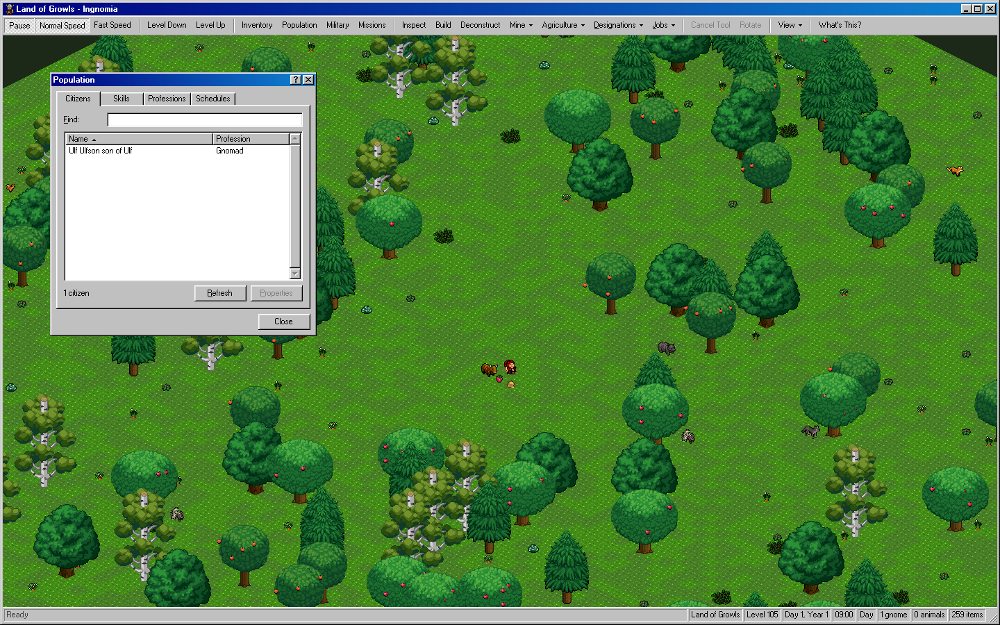
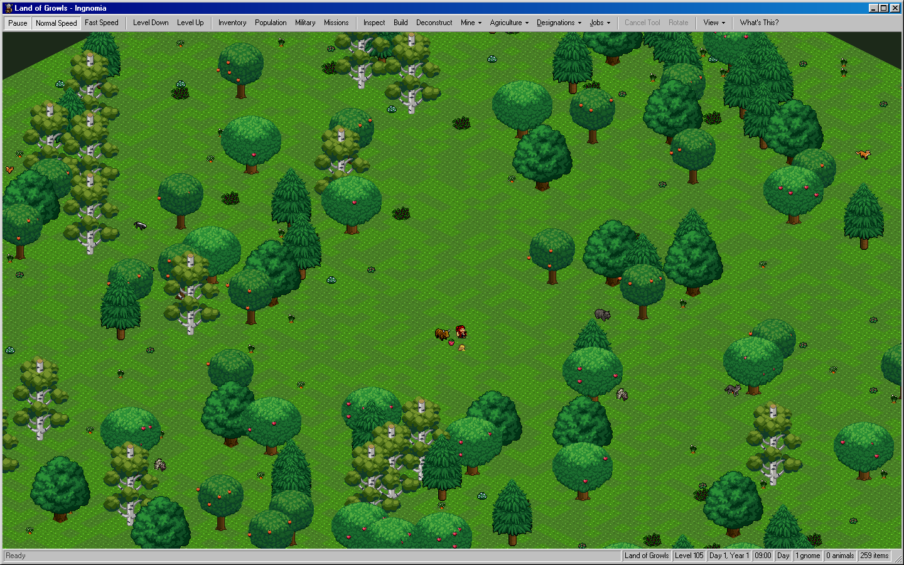
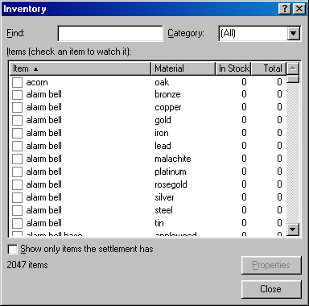
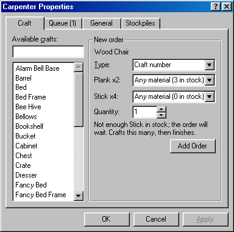
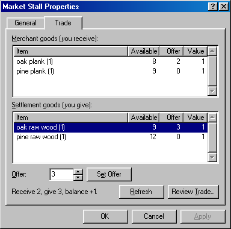
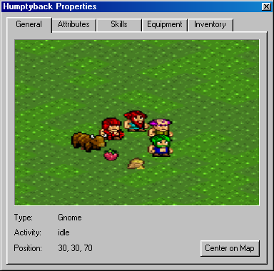
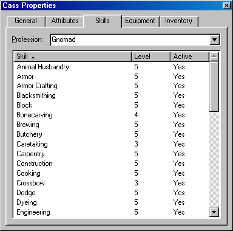
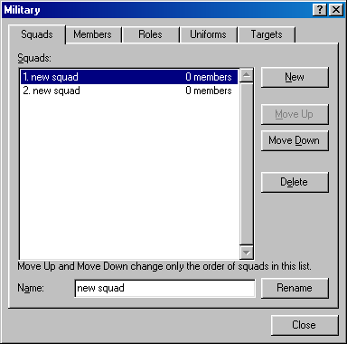

# Ingnomia

Ingnomia is a colony-management game inspired by [Gnomoria](https://store.steampowered.com/app/224500/Gnomoria/). This community fork builds on the original game by **Ralph Schurade (@rschurade)** and focuses primarily on a refreshed, more cohesive interface.

## Screenshots

All screenshots are from the current build. The world images are a new game generated with the default world settings.

### Game world

*A new world with the Population window open over the map.*

### Inventory

*Find items by name or category and compare in-stock and total quantities.*

### Workshops and trade

*Queue crafts with per-component material choices.*

*Build a trade offer and review the balance before you commit.*

### Creatures

*Every creature has a property sheet with attributes, skills, equipment, and inventory.*

### Military

## What this fork changes

This is **mostly a UI update**, not a new game. The interface is rebuilt with Qt 6 and RmlUi in a classic Windows 98 style: a toolbar and status bar, property sheets for every workshop, stockpile, farm, and creature, and redesigned management windows for inventory, population, military, and diplomacy, with keyboard access keys throughout.

Gameplay additions are modest so far:

- Choose crops per plot and save planting queues, including repeat and quantity options.
- A refreshed, seeded tutorial scenario and starting setup.

## Download

Windows builds are published on the fork's [Releases page](https://github.com/harminoff/Ingnomia/releases). The original project is also available on [Steam](https://store.steampowered.com/app/709240/Ingnomia/).

Pushing a `v*` tag runs the Windows build workflow and publishes the packaged game as a GitHub release.

## Credits and license

Ingnomia was created by **Ralph Schurade (@rschurade)**. This fork builds on and retains attribution to the [original Ingnomia project](https://github.com/rschurade/Ingnomia). Ingnomia was inspired by Gnomoria and includes assets used with permission by the original project.

This repository is licensed under the [GNU Affero General Public License v3](LICENSE). See the upstream project for its community and original release information.
