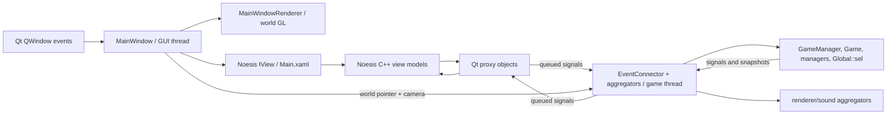
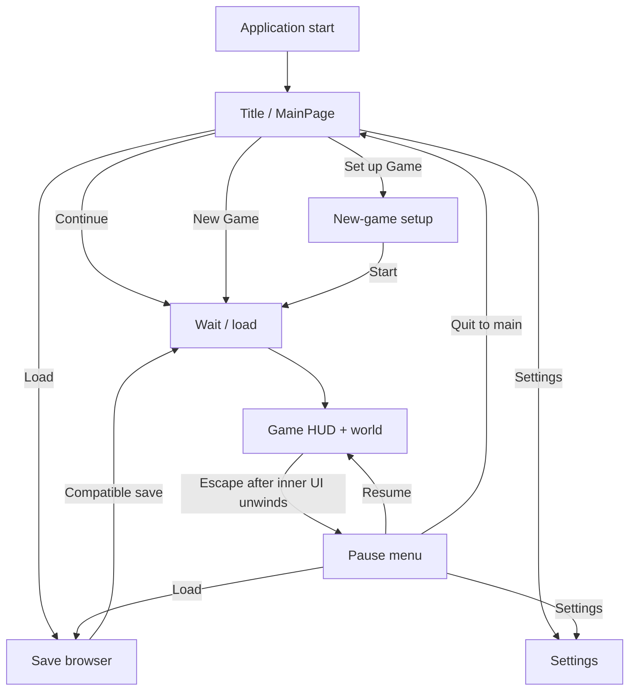
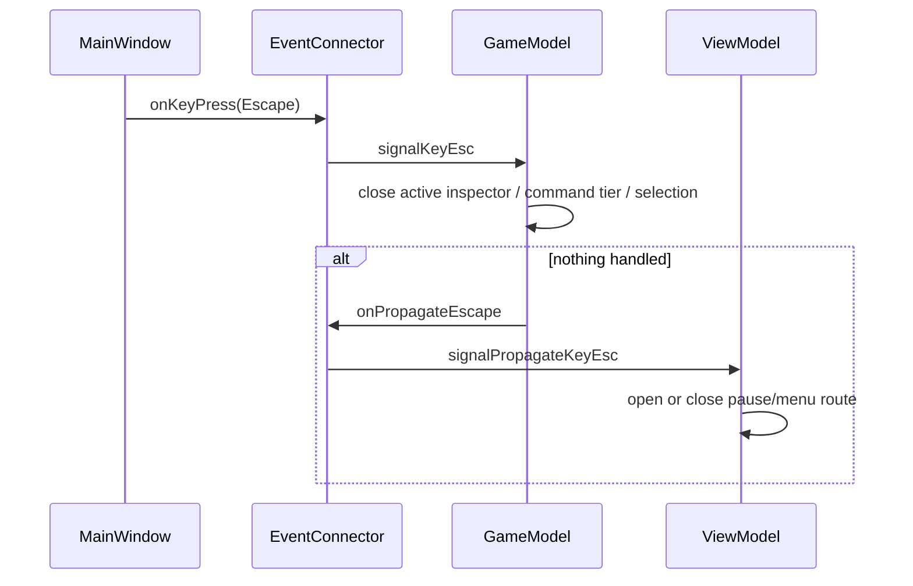

# Current Upstream UI and Dependency Map

## Purpose and evidence boundary

This document maps the player-facing interface that exists in the clean upstream source before the RmlUi replacement begins. It describes what the player can do, how those actions cross the UI/game boundary, and which behavior is migration-critical.

The source baseline is commit `4f99266c0f95faa847ca0db2af18cf59aff07f4b` (`v0.9.0`, `origin/master`), inspected on branch `feat/rmlui-interface-rebuild`. The map is a static source audit. It does **not** claim that a control, save mutation, focus path, or graphics result was exercised at runtime.

Companion evidence:

- [`current-ui-map.json`](current-ui-map.json) is the normalized, machine-readable 23-row screen/component map with every field required by the migration plan.
- [`current-ui-inventory.json`](current-ui-inventory.json) is the exhaustive generated occurrence inventory.
- [`tools/inventory_current_ui.py`](tools/inventory_current_ui.py) regenerates or checks the occurrence inventory.

The prerequisite source has one material repository anomaly. `.gitmodules` declares `src/base/beehive` at `https://github.com/crust/beehive.git`, but `git ls-files --stage src/base/beehive` and `git ls-tree HEAD src/base/beehive` return no entry: upstream `HEAD` has no gitlink at that path. The working directory was intentionally populated from that declared URL after recursive submodule initialization failed in the local Git wrapper. It was treated as read-only prerequisite source and remains untracked. A future clean checkout cannot assume normal submodule initialization will recreate it.

## Inventory result

The deterministic scanner found:

| Evidence | Count |
| --- | ---: |
| XAML documents | 70 |
| XAML documents under `content/xaml` | 67 |
| ResourceDictionary documents | 47 |
| Binding expressions | 900 |
| Commands and XAML event handlers | 332 |
| Visibility conditions | 151 |
| Merged resource references | 148 |
| Defined resource keys | 2,474 |
| DataTemplates | 62 |
| Converter resources | 3 |
| Image-source occurrences | 36 |
| Noesis include occurrences | 283 |
| Noesis reflection macro occurrences | 200 |
| Reflected property occurrences | 607 |
| Registered Noesis components | 39 |
| Qt UI bridge classes with `Q_OBJECT` | 34 |
| State/command enums in UI headers | 11 |
| Configured keybinding groups | 4 |

The three XAML documents outside `content/xaml` are Blend sample-data documents under `gui/SampleData`; they are design-time inputs, not runtime screens.

The generated JSON records path, line, and raw expression for each binding, action/event, visibility condition, merge, converter, image, static resource, resource key, DataTemplate, Noesis include/type/reflection/property/registration, Qt signal/slot/connection, state enum, and configured keybinding. Counts are occurrence counts, not unique semantic fields.

## Runtime architecture

The application is a Qt/OpenGL executable with a manually hosted Noesis view over the game renderer:



### Startup and ownership

`src/main.cpp` requests a core OpenGL context, enables shared OpenGL contexts, configures high-DPI rounding, creates a `MainWindow` with a minimum size of 1200x675, and moves `GameManager` to a dedicated `QThread`. `GameManager` owns the game-side lifecycle; `MainWindow` and Noesis remain on the GUI thread.

`EventConnector` is created before `GameManager` is moved, then its connector/aggregator children travel with the game manager to the game thread. Noesis view models create GUI-side proxy objects. Most proxy-to-aggregator and aggregator-to-proxy connections are explicitly queued, which is the thread-crossing contract the replacement must retain.

During `MainWindow::initializeGL`, the host:

1. creates and binds its `QOpenGLContext`;
2. initializes GLAD and the game `MainWindowRenderer`;
3. points Noesis XAML, texture, and font providers at `<dataPath>/xaml/`;
4. registers the reflected user controls, models, collections, commands, and converters;
5. loads `Main.xaml`, assigns a `ViewModel`, and creates an `IView` and GL renderer.

### Per-frame composition and resize

`paintGL` renders the world first, updates the Noesis view, calls `UpdateRenderTree`, renders Noesis off-screen content when requested, restores framebuffer/viewport state, renders the main Noesis pass, and swaps buffers. Off-screen UI rendering can disturb GL state; the existing explicit restore is part of the renderer boundary, not incidental cleanup.

On resize, Noesis receives logical window width/height. The OpenGL viewport uses `width * devicePixelRatio` and `height * devicePixelRatio`. The world renderer also receives the resize. This creates a high-DPI validation requirement: pointer hit testing and Noesis layout use logical coordinates while the framebuffer is physical pixels.

The root `Main.xaml` uses two `Viewbox` roots. `ViewModel.Width` and `Height` are the real window dimensions divided by `UIScale`; this globally scales both menu and HUD. Several management windows themselves use large fixed dimensions around 1400x700, so 1200x675, non-100% scales, and high-DPI displays require explicit clipping/focus/hit-test checks.

## Build and third-party dependency surface

The root build currently requires Qt 6 Core, Xml, Sql, Gui, and Widgets; OpenGL; Steam; Noesis; OpenAL; and Windows-only/runtime packaging helpers. The executable links `NoesisApp`, not only the core Noesis library.

`3rdparty/NoesisApp/CMakeLists.txt` compiles the official Noesis application support package and GL render context/device sources into a static library. On Unix it additionally finds Threads, OpenGL, and X11. The root build:

- requires Noesis license name/key cache variables and generates `src/gui/license.h`;
- stages/installs the entire content tree, including XAML, fonts, and images;
- copies the Noesis runtime library beside the executable;
- runs `windeployqt` on Windows;
- exposes a Windows Blend external C# project for XAML design work;
- uses Windows-specific dedicated-GPU exports/`WinMain` behavior and Unix-specific position-independent build settings.

This is a broad removal boundary. RmlUi migration must account for headers/types/reflection, registered components, generated license data, runtime DLL staging, content staging, Blend design files, `NoesisApp`, and platform linkage—not just replace `Main.xaml`.

## Navigation and player flow



`ViewModel::State` defines `Main`, `Start`, `Settings`, `NewGame`, `LoadGame`, `Wait`, `GameRunning`, and `Ingame`. `Main.xaml` selects only the menu root and game root through `ShowMainMenu`/`ShowGameGUI`; `MainMenu.xaml` stacks menu pages and reveals them with DataTriggers/storyboards. `Start` is present in C++ state but no distinct player-facing Start page was identified.

The main page offers two different new-game paths:

- **New Game** starts immediately from the current `Global::newGameSettings`.
- **Set up Game** opens the full `NewGamePage` editor.

Continue scans for the newest compatible save. Load uses `AggregatorLoadGame` to enumerate kingdoms, then saves and metadata for the selected kingdom, including compatibility. Starting/loading calls `GameManager::init`, which stops an old game, resets global state, reloads strings, constructs the new game, and connects aggregators/renderer/selection. It is a lifecycle transition, not a view-only route.

Save pauses, performs save IO, and restores/resumes. Returning to the main menu also changes game pause/menu state. These paths need state and save-artifact proof after migration.

## Escape, focus, and keyboard contract

The keyboard routing order is behaviorally significant:

1. Except for Space, `MainWindow` forwards `KeyDown` to Noesis first.
2. If Noesis consumes the key, game handling stops.
3. A `Char` is separately synthesized only for a narrow key-code range (`32..255`) when the Qt text contains one character.
4. Unconsumed keys use direct Qt switch logic for camera, render options, selection rotation, escape, pause, and other host actions.
5. Key release is always forwarded to Noesis and clears matching WASD camera movement.

Space is an exception: it bypasses Noesis `KeyDown` and toggles pause directly. Existing direct shortcuts include:

| Input | Current behavior |
| --- | --- |
| `W/A/S/D` | Camera pan while held |
| `Space` | Toggle pause before GUI key consumption |
| `Escape` | Request inner UI/selection back; propagate to pause only if nothing handled it |
| `H` | Toggle wall rendering |
| `O` | Toggle overlays; Ctrl modifies debug behavior |
| `R` | Rotate active selection; Ctrl uses a debug GL path |
| `,` / `.` | Rotate the world |
| Wheel | GUI scroll, world zoom, or world z-level depending on hit and Ctrl XOR setting |

The escape chain is deliberately two-stage:



The root `keybindings.json` contains four groups and many declared navigation/global/build/debug command records. `KeyBindings` can parse and look them up, but `Global` has `m_keyBindings.update()` commented out and `MainWindow` does not call `getCommand`. Therefore the catalog is **declared but inactive** in this upstream path. Migration parity means retaining proven direct behavior; activating dormant configurable commands is a separate product decision.

Focus is forwarded to Noesis through `Activate`/`Deactivate`. Static inspection did not find a comprehensive host-side reset of all interaction state on focus loss, so stuck camera/mouse states need runtime validation. The title page explicitly establishes initial button focus after its fade-in. The event popup has no explicit keyboard-default or focus-trap contract in the inspected code.

## World-versus-GUI pointer boundary

This is the highest-risk compatibility seam.

`MainWindow::isOverGui(x, y)` runs a Noesis visual-tree hit test. A returned visual means the GUI owns that event position. Transparent layout geometry can therefore steal a map event even when it looks empty; conversely, the absence of a full-screen visual permits click-through.

### Mouse move and camera drag

Every mouse move is sent to Noesis. Separately, if the left press began in the world, moving more than 5 pixels on either axis changes the gesture into a camera drag. Once that happens, movement continues to pan the camera even if the pointer crosses over a GUI visual. The host also keeps sending world-cursor coordinates to the selection path while over GUI, so selection preview state can move behind the interface.

### Press/release state table

| Gesture | Current result |
| --- | --- |
| Press and release left over GUI | Noesis down/up; no world click |
| Press left in world, move <=5 px, release in world | World cursor update then `signalLeftClick` |
| Press left in world, move >5 px | Camera drag; release does not select |
| Press left in world, release over GUI | Noesis receives up even though it did not receive this down; world click is suppressed |
| Press left over GUI, release over world | Noesis receives up because the press was not recorded as a world press |
| Press/release right over GUI | Noesis down/up |
| Press/release right in world | World cursor update then `signalRightClick` |
| Right world click with selection active | Back/cancel the active selection |

World clicks are intentionally committed on **release**, not press. Button-origin flags (`m_leftDown`, `m_rightDown`) and the drag flag distinguish click, drag, and GUI ownership. The asymmetric crossing cases above may be odd, but they are current behavior and must not be silently changed without a deliberate input-policy decision and regression test.

There is an additional source-observed asymmetry: left release clears `m_leftDown` in both branches, but a world-origin right press released over GUI sends Noesis `MouseButtonUp` without clearing `m_rightDown` in that branch. Boundary-crossing validation should specifically detect retained right-button state.

### Tile projection and action ownership

World mouse/click signals reach `AggregatorSelection` with cached viewport and camera data. It projects the cursor into the map, searching downward across up to 20 z-levels; Shift forces selection at the visible level.

On a left click:

- if `Global::sel` has an active action, the click advances/commits that selection;
- if there is no active action, the tile ID opens/refreshes TileInfo.

On a right click, an active selection backs out/cancels. `R` rotates the placement. Selection cursor, first click, and size are sent back to both renderer preview and `SelectionGui`.

### Wheel and z-level behavior

If the wheel is over a GUI visual, Noesis receives `MouseWheel` and the world does nothing. Otherwise `Ctrl XOR toggleMouseWheel` chooses world zoom versus z-level traversal. Zoom uses a continuous exponential factor based on wheel delta. Z helpers clamp to the game-state bounds, update the renderer, publish view level/render parameters, and recompute the mouse projection. Shift is passed into the z helper/projection path. The replacement must preserve event consumption before applying world wheel behavior.

### Required migration invariants

The following need explicit automated or physical-input coverage:

- no map click through an opaque/interactable GUI surface;
- intended empty HUD space remains map-clickable;
- 5-pixel camera drag threshold and world-origin gesture ownership;
- click committed on release, and drag does not select;
- GUI press/release and boundary-crossing cases do not leave stuck button states;
- right-click cancels selection and does not activate underlying UI;
- GUI wheel scroll wins over world zoom/z-level;
- Ctrl/settings XOR behavior, wheel direction, zoom magnitude, and z bounds;
- Shift selection/z semantics;
- high-DPI logical coordinate alignment;
- focus loss does not leave camera movement or buttons stuck;
- event prompt/modal surfaces explicitly block or allow world input as designed.

## Player-facing surface catalog

The JSON map is authoritative for per-row bindings/actions/proxies/update sources and provisional RmlUi targets. This table is the concise player-oriented index.

| Surface/component | Player purpose | Entry/action path | Current status / migration concern |
| --- | --- | --- | --- |
| Application host/input | Compose world and GUI; arbitrate every input | Qt events -> Noesis hit/consume or world signals | Not started; critical parity seam |
| Root route shell | Switch menu/game and scale both roots | `Main.xaml` + `ViewModel` | Not started; preserve mutually exclusive roots and escape propagation |
| Title/main menu | Continue, new, setup, load, settings, exit | `MainPage` commands -> `ProxyMainView` -> `EventConnector` | Not started; immediate New Game differs from setup |
| New-game setup | Configure generated world and starting assets | `NewGameModel` wraps `Global::newGameSettings` | Not started; broad stateful form and template lists |
| Continue/load browser | Select compatible save metadata and load | `LoadGameProxy` <-> `AggregatorLoadGame` | Not started; lifecycle teardown/init and compatibility gate |
| Settings | Change scale/window/language/input/audio settings | `SettingsProxy` <-> `AggregatorSettings` -> Config | Not started; immediate persistence and key/unit mismatches |
| Wait/loading | Cover start/load transition | `ViewModel::Wait` | Not started; define input blocking explicitly |
| Pause/save/menu | Resume, load, save, settings, quit | propagated Escape / pause commands | Not started; two-stage escape and real save proof |
| HUD/status/watch/speed | Read kingdom/time/view status and control speed/render options | `GameModel` <-> `ProxyGameView`/`EventConnector` | Not started; avoid transparent hit-test blockers |
| Action bar/selection | Choose jobs/build/designations and act in world | model command tiers -> `Global::sel` -> `AggregatorSelection` | Not started; highest gameplay mutation risk |
| Tile inspector | Inspect tile and invoke contextual jobs/managers | no-action world click -> TileInfo aggregation | Not started; live tile refresh and contextual mutations |
| Creature inspector | Inspect creature/profession/needs/equipment | TileInfo creature -> CreatureInfo | Not started; profession mutation |
| Agriculture | Manage farm/pasture/grove | embedded TileInfo designation region | Not started; duplicate/unreachable standalone route exists |
| Stockpile | Filters, limits, priority, pull, contents | TileInfo manage -> Stockpile overlay | Not started; nested identity-sensitive filter tree |
| Workshop/trader | Craft queue and specialized/trade workflows | TileInfo manage -> Workshop overlay | Not started; multiple conditional modes and real inventory mutation |
| Population | Professions, skills, schedules | bottom Population button | Not started; dense nested editors |
| Inventory | Browse resources and totals | bottom Inventory route | Not started; current button label appears inconsistent |
| Military | Squads, roles, members, uniforms | bottom Military button | Not started; collection identity and assignments |
| Neighbors/missions | Diplomacy facts and mission assignments | bottom Missions button | Not started; Kingdom branch itself is empty |
| Event prompt | Answer event OK/yes/no | Event system -> EventConnector -> GameModel | Not started; semantic modal without proven full input shield |
| Debug | Inspect/spawn/debug simulation | HUD debug button/direct shortcuts | Not started; gate and disposable-save validation |
| Resources/theme/localization | Labels, templates, fonts, icons, scenery | merged dictionaries/static assets | Not started; explicit `en_US` merges block dynamic locale switching |
| Keybinding catalog | Intended configurable command mapping | root `keybindings.json` -> dormant `KeyBindings` | Not started; declared, not wired |

### In-game surface ownership

`GameModel::ShownInfo` provides exclusive central-window ownership for TileInfo, Stockpile, Workshop, Population, CreatureInfo, Debug, Neighbors, Military, and Inventory. Agriculture is present as an enum/path but the reachable UI is embedded in TileInfo's designation region. `SelectionGui` is separate and remains visible as a small status readout. `OnCmdBack` closes an active shown surface, unwinds action tiers, or cancels selection before propagating Escape.

Current incomplete or inconsistent branches that should be recorded rather than accidentally “completed” as parity work:

- the right-side Kingdom branch is empty;
- the Magic action branch has no subcommands;
- Agriculture “Plant tree” has an empty action;
- a `ShowAgriculture` route exists but no separate Agriculture surface is instantiated in `GameGui`;
- the Inventory button's static label appears to say “Stockpiles”;
- several close buttons carry copied/wrong command parameters, but current `GameModel` close handling ignores the parameter.

These are product/UX decisions for the replacement architecture. They are not evidence that the underlying game action already exists.

## Data and command bridge patterns

There are three recurring interaction paths.

### Menu/lifecycle commands

`ViewModel` commands call `ProxyMainView`, which emits queued Qt signals to `EventConnector`; `EventConnector` invokes `GameManager` for new/continue/load/save/show-menu/end. Reverse signals publish version, load readiness, menu state, resume, window size, and scale back to the view model.

### HUD/global commands

`GameModel` calls `ProxyGameView`; queued signals reach `EventConnector` for pause, speed, render options, answers, build commands, selection action/item/materials, and surface requests. Time/date, kingdom status, view level, event prompts, pause/speed, render flags, and build notifications return to the model.

### Management-window data

Each management model owns a small GUI-thread proxy. Its queued requests reach a focused game-thread aggregator that snapshots authoritative managers and emits plain GUI records/collections back. Examples:

- `AggregatorAgri`: Farm/Pasture/Grove data and mutations;
- `AggregatorCreatureInfo`: selected creature and professions;
- `AggregatorDebug`: needs/decay/spawn/size data;
- `AggregatorInventory`: inventory category/filter/build/watch data;
- `AggregatorLoadGame`: kingdom/save metadata;
- `AggregatorMilitary`: squads, roles, priorities, members, uniforms/materials;
- `AggregatorNeighbors`: neighbors and missions;
- `AggregatorPopulation`: population/profession/skill/schedule data;
- `AggregatorSelection`: projected cursor/click/selection preview;
- `AggregatorSettings`: config snapshots and immediate writes;
- `AggregatorStockpile`: filters, contents, priority/limits/pull/suspend;
- `AggregatorTileInfo`: selected tile snapshot and context actions;
- `AggregatorWorkshop`: craft queue, special modes, trader inventory/offer.

`GameManager::postCreationInit` wires manager changes to aggregators: farms/pastures/groves, stockpile addition/content/tick, workshop job lists, inventory add/remove, mission updates, tile updates, time/kingdom/heartbeat, and selection geometry. Some large surfaces primarily request a snapshot on open while others also receive focused update signals. Migration should reuse or adapt these existing game-thread seams rather than make RmlUi read simulation objects across threads.

## Build and designation actions

The bottom action bar builds tiered commands in `GameModel`. Simple mine/designation/job choices set `Global::sel` action strings. Build choices request available items/materials from `AggregatorInventory`; selected `BuildItemType` plus parameters/item/materials goes through `EventConnector::onCmdBuild`, which translates to the selection action and emits the build signal.

Build variants include filling holes, replacing, and building, and categories cover workshop, wall, floor, stairs, ramp, fence, containers, furniture, and utility-style entries. The migration contract includes the typed action, item ID, material list, availability filtering, placement rotation, preview, first/second click, and final game mutation. A toolbar that only renders all buttons is not validated.

## Surface data breadth

The exhaustive inventory holds the exact 607 reflected property occurrences. The largest semantic groups are:

- NewGame: generation ranges, seed/name/presets, starting items/animals/materials;
- GameModel: HUD, actions, build tiers, visibility and event prompt state;
- TileInfo: terrain, tile objects, jobs/designations, room/tenant/alarm, mechanisms;
- Agriculture: farm/pasture/grove products, animals, limits and state;
- Workshop: queue/order controls, butcher/fisher/trader data;
- Military: squads, roles, attitudes, priorities, members, uniform/materials;
- Population: gnomes, professions, skills, priorities, schedules/hours;
- Stockpile: category filters, stocked items, limits, priority, pull, suspend;
- Neighbors: neighbor facts, missions/actions, available/assigned gnomes;
- CreatureInfo: attributes, activity, profession, needs and equipment slots;
- Inventory: category/filter tree, stock and totals;
- Settings and LoadGame: configuration and save-browser state.

The runtime XAML document occurrence totals illustrate where behavior is concentrated:

| Runtime XAML | Bindings | Commands/events | Visibility conditions |
| --- | ---: | ---: | ---: |
| `Agriculture.xaml` | 66 | 18 | 9 |
| `CreatureInfo.xaml` | 32 | 4 | 0 |
| `DebugGui.xaml` | 43 | 19 | 4 |
| `GameGui.xaml` | 57 | 32 | 17 |
| `IngamePage.xaml` | 5 | 5 | 0 |
| `InventoryGui.xaml` | 2 | 2 | 0 |
| `LoadGamePage.xaml` | 7 | 3 | 0 |
| `Main.xaml` | 6 | 0 | 2 |
| `MainMenu.xaml` | 12 | 0 | 5 |
| `MainPage.xaml` | 13 | 6 | 0 |
| `MilitaryGui.xaml` | 11 | 10 | 3 |
| `Neighbors.xaml` | 18 | 10 | 4 |
| `NewGamePage.xaml` | 57 | 9 | 0 |
| `PopulationWindow.xaml` | 49 | 70 | 3 |
| `SelectionGui.xaml` | 4 | 0 | 0 |
| `SettingsPage.xaml` | 12 | 2 | 0 |
| `StockpileGui.xaml` | 12 | 2 | 0 |
| `TileInfo.xaml` | 55 | 6 | 18 |
| `WaitPage.xaml` | 0 | 0 | 0 |
| `WorkshopGui.xaml` | 58 | 11 | 8 |

Low counts in `InventoryGui`, `MilitaryGui`, and similar roots do not mean a small data surface. Much of their binding/action behavior lives in type-selected DataTemplates in `styles/mainmenu/styles.xaml`.

## Settings, localization, and assets

### Settings and configuration

The settings UI exposes:

- UI scale choices 50%, 75%, 100%, 150%, and 200%;
- fullscreen;
- language choices `en_US` and `fr_FR`;
- keyboard camera speed from 0 to 200;
- minimum light from 0 to 100;
- the mouse-wheel behavior toggle;
- master volume from 0 to 100.

Changes persist immediately; there is no Apply/Revert transaction. Static audit found several compatibility hazards:

- bundled `content/JSON/config.json` contains `GUIScale`, while `Config` synthesizes lowercase `uiscale` if absent;
- bundled language is `english`, which is not one of the settings model's `en_US`/`fr_FR` IDs, so the model falls back to its first option;
- bundled config does not contain `AudioMasterVolume`;
- the settings snapshot multiplies stored master volume by 100, while the setter stores the UI value directly and sound reads the config directly, indicating a possible unit mismatch;
- `toggleMouseWheel` is synthesized only through QVariant default behavior if absent, and comments/field descriptions disagree about which boolean direction means zoom versus z-level. The executable expression is the authority: `Ctrl XOR config` selects its first branch.

These are source-observed risks, not runtime-confirmed failures.

### Localization

`en_US.xaml`, `fr_FR.xaml`, and `pt_BR.xaml` exist, but every inspected player-facing document with localization explicitly merges `localization/en_US.xaml`. `AggregatorSettings::onSetLanguage` persists the language while its `signalSetLanguage` emission is commented. `Strings` reads the config on initialization, but the translation-table selection code is also commented and current string loading uses its existing database path.

Therefore a language chooser is present, but a complete runtime locale swap is not. The RmlUi layer needs an explicit localization provider, missing-key policy, locale-change lifecycle, and separation of stable command/data IDs from translated text. Existing hard-coded English in XAML/C++ must be inventoried during conversion.

### Fonts, icons, and images

The content includes 8-bit Operator variants, Hermeneus One, weblysleek UI, PT Root UI theme fonts, and the SIL Open Font License. `MainMenu` and `GameGui` use `Fonts/#8-bit Operator+`; the imported theme uses PT Root UI. Assets include action-category/object icons, clock frames, seasonal/time scenery, clouds, trees, lake/mountains, and menu backgrounds.

Paths and licenses must remain staged in installed builds. RmlUi conversion should preserve asset identity and only change format where the renderer requires it; missing glyph, atlas/filtering, high-DPI scaling, and relative URI behavior need runtime proof.

## Modal and non-modal behavior

Most management windows are non-modal overlays centered over a still-visible world. Their visible rectangles consume GUI pointer events; other areas may remain world-interactive. The pause menu is semantically modal because it replaces the game GUI and GameManager pauses. Wait/loading is intended to be blocking. The event prompt is semantically modal to the decision workflow, but static XAML inspection only proves a centered panel, not a full-screen input shield or focus trap.

RmlUi must make these policies explicit. Full-viewport transparent documents are especially dangerous because they can block all map hit testing even when only a small child panel is visible.

## Provisional replacement split

The component names in `current-ui-map.json` are seam proposals for planning, not implemented files and not an architecture mandate:

- `documents/app_shell.rml` and `runtime/RmlUiHost` own composition/input;
- `screens/*.rml` own title, setup, load, settings, loading, and pause routes;
- `hud/game_hud.rml`, `hud/action_bar.rml`, and `hud/selection_status.rml` own map-adjacent controls;
- `panels/*.rml` own tile/creature/agriculture inspectors;
- `windows/*.rml` own large stockpile/workshop/population/inventory/military/diplomacy surfaces;
- `modals/event_prompt.rml` owns explicit event modality;
- `shared/theme.rcss`, localization adapter, and shared components replace ResourceDictionary/template infrastructure;
- controller/adapters own world selection, command routing, and existing Qt bridge reuse.

Every row remains `migration_status: not_started`. Every validation value is static-source-only and names the missing runtime proof. Later agents should update statuses monotonically rather than infer completion from document creation.

## Validation performed for this map

The documentation/inventory slice used read-only source searches plus deterministic generation. Relevant commands and results:

```powershell
git rev-parse HEAD
# 4f99266c0f95faa847ca0db2af18cf59aff07f4b

git describe --tags --exact-match HEAD
# v0.9.0

git ls-files --stage src/base/beehive
git ls-tree HEAD src/base/beehive
# both produce no entry; .gitmodules nevertheless declares the path and URL

python docs\ui-migration\tools\inventory_current_ui.py
# writes docs/ui-migration/current-ui-inventory.json

python docs\ui-migration\tools\inventory_current_ui.py --check
# inventory is current
```

The generated map is separately parsed and checked for all 13 required fields, uniqueness of `screen_or_component`, and valid JSON. Final handoff also runs `git diff --check` and a docs-only patch-boundary audit.

No build or runtime was performed for this documentation-only slice. Build success, executable startup, framebuffer composition, physical keyboard/mouse behavior, state-changing commands, save/load, language changes, audio units, and installed-package content remain later validation gates.

## Risk register for downstream agents

1. **Input boundary regression:** RmlUi hit-test geometry or event propagation can block the map or click through controls.
2. **Gesture state regression:** press origin, release ownership, 5-pixel drag, right-click, and focus loss can leave incorrect/stuck state.
3. **Wheel/z regression:** GUI scroll, zoom, z-level, Ctrl XOR config, Shift, direction, and bounds are coupled.
4. **Thread regression:** direct RmlUi access to game managers would bypass the queued proxy/aggregator boundary.
5. **Lifecycle regression:** load/new/return-to-menu rebuild game/global/aggregator state; stale callbacks/models are possible.
6. **Dormant-feature confusion:** `keybindings.json` declares actions that the current host does not dispatch.
7. **Template undercounting:** small root XAML files can depend on large resource DataTemplates and reflected record types.
8. **Modal ambiguity:** event/wait/full-screen transparent roots need explicit input/focus policy.
9. **Scale/DPI regression:** logical UI coordinates and physical GL viewport differ; fixed-size management layouts can clip.
10. **Localization incompleteness:** current locale selection is not a functioning XAML resource swap and hard-coded English remains.
11. **Settings compatibility:** case/default/unit mismatches can change behavior merely by visiting the settings screen.
12. **Packaging dependency:** fonts/images/content and platform runtime files must be tested from the installed/package layout.
13. **Upstream source anomaly:** the declared beehive submodule has no gitlink at `HEAD`; reproducible dependency acquisition needs resolution.

This map's acceptance boundary is source coverage and reproducibility of the inventory—not functional parity. Functional parity begins when each row's representative read, command, input, mutation, focus, and lifecycle paths are exercised against the replacement runtime.
