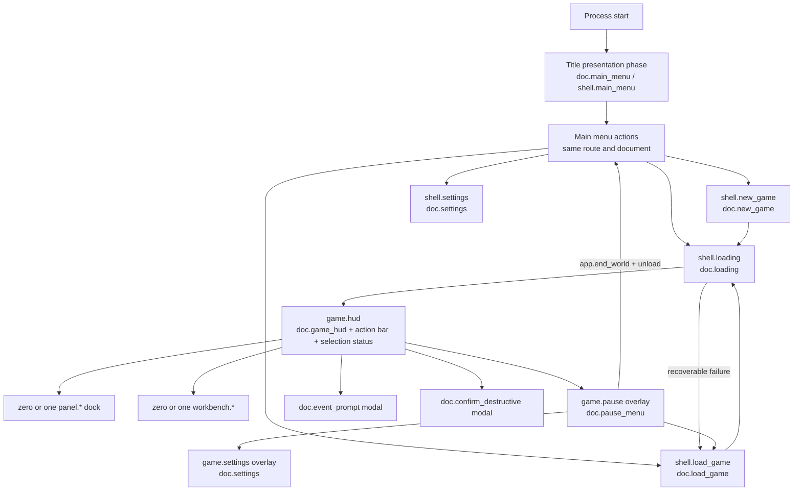

# UX specification and information architecture

Status: **normative design proposal; implementation remains gated by the architecture spike and master plan**

Baseline: upstream commit `4f99266c0f95faa847ca0db2af18cf59aff07f4b`

Depends on: `01-current-ui-map.md`, `02-competitive-research.md`, `03-rmlui-architecture.md`, and the normative identifiers in `04-ui-data-contracts.md`

## Purpose and evidence discipline

This specification defines the complete replacement information architecture, interaction behavior, and original text wireframes. It does not create an RML document, asset, gameplay rule, or data producer. All displayed values and enabled actions must bind to the typed state and `ActionId` registry in `04-ui-data-contracts.md`.

The wireframes use these evidence marks:

- **[C] Contracted:** a current upstream source or accepted contract provides the datum/action.
- **[S] Session presentation:** derived only from already loaded contracted state and not persisted (for example, catalog search and confirmed recent tools).
- **[P] Proposed contract:** useful, but it must be omitted until a real authoritative producer/action is accepted.
- **[D] Development only:** excluded from the release document/action registry.

No mock number, demo trend, fake warning, or disabled promise stands in for missing state. A whole control or section is omitted when its backing is absent. Loading, empty, unknown, stale, and error are explicit states; `0` is only shown when zero is an authoritative value.

## Experience principles

1. **The colony is the canvas.** Routine play keeps the map center clear. Controls occupy shallow edges; context uses one dock; dense work opens one coherent workbench.
2. **Inspect is home.** Every temporary tool has a name, phase, visible cancel path, and one-step return to `inspect`.
3. **Verticality is persistent.** Level, bounds, up/down controls, and off-level selection cues stay beside time and speed.
4. **Data earns its place.** Persistent HUD state is limited to contracted settlement, clock, view, overlay, and watch values.
5. **State explains action.** Pending, accepted, rejected, blocked, disabled, selected, stale, and unavailable are visibly distinct.
6. **Context docks; management organizes; decisions interrupt.** Routine selection is non-modal. Only required event responses, destructive confirmation, and fatal errors trap focus.
7. **Stable identity survives presentation changes.** Search, sort, filtering, patches, and locale changes never retarget selection by display text.
8. **Theme serves legibility.** Dwarven character comes from weight, rhythm, stone/metal material cues, and restrained motion, never unreadable type or decoration behind text.

## Canonical information architecture

The navigation model is exactly one primary route, zero or one workbench, zero or one dock, an overlay-route stack, and a modal stack. The document registry and routes below are normative from `04-ui-data-contracts.md`.



### Shell regions

| Region | Contracted contents | Behavior |
|---|---|---|
| top-left settlement pulse | kingdom name, gnomes, animals, items | compact text/value group; no food, drink, beds, idle worker, job, or shortage counters until contracted |
| top-center world controls | day, season, year, time, daylight/next sun event, z-level and bounds, pause, Normal/Fast | fixed location; keyboard reachable; pending pause does not pre-empt authoritative state |
| top-right status | contracted watch rows and overlay entry | alert summary is entirely absent until an alert producer exists; event prompts use the modal stack |
| tool shelf | typed current tool categories and loaded catalog | shallow at rest; expands for category/catalog/material selection; map stays visible |
| right dock | one selected tile, creature, stockpile, workshop, or agriculture panel | resizable/collapsible at capable widths; maintains selected `EntityRef` |
| management workbench | population, inventory, military, diplomacy | consistent route tabs, toolbar, table/tree, detail editor, status strip |
| bottom hint strip | active tool, cursor/anchor/size, valid/invalid counts, repeat/rotate/cancel hints | content comes from `ui_tools`; never invents an invalidity reason |
| modal layer | required event, destructive confirmation, error | full input blocker, focus trap, no world input |

### Workbench navigation

The global management destinations are Population, Inventory, Military, and Diplomacy because these routes and documents are contracted. Production, Stockpiles, and Agriculture remain contextual docks tied to a selected world object; they are not fabricated global list routes. Jobs/work assignments are tabs within Population. Reports/alert history is omitted until a producer exists. Debug is registered only in development builds.

Every workbench uses this common frame:

```text
+-- Management ------------------------------------------------ [Close] -+
| Population | Inventory | Military | Diplomacy                    |
| [Heading]  [Search if loaded rows support it] [Filters] [Sort]   |
|------------------------------------------------------------------|
| stable-ID navigation/list      | selected-row details/actions    |
| loading / empty / error inline | (sequential below at compact)   |
|------------------------------------------------------------------|
| row count | selection state | pending/error result | Locate only with a real EntityRef/position [C] |
+------------------------------------------------------------------+
```

Only presentation-local search/sort/filter is shown where the full relevant collection is loaded. It never triggers uncontracted domain queries. `view.center_on` powers Locate only when a row has an `EntityRef` or `WorldPosition`.

## Global interaction contract

### Pointer and world ownership

- Full-viewport HUD roots have `pointer-events: none`; only visible interactive descendants opt in.
- Button-down establishes UI or world gesture ownership until release. Crossing the boundary does not transfer ownership.
- World left click commits on release. A world-origin movement beyond the retained 5-pixel threshold becomes camera drag and cannot select.
- UI wheel scroll wins over world zoom/z-level. Unconsumed wheel preserves the current `Ctrl XOR camera.wheel_changes_level` behavior.
- Right click cancels/backs the active tool only when the gesture belongs to the world. It never clicks through a dock, menu, or modal.
- Focus loss clears held camera keys, gesture ownership, hover/IME state, but does not dispatch a gameplay cancel.

### Keyboard, focus, and Escape

1. Focused text edit and the top modal receive keys/text first. Physical keys and committed UTF-8 text remain separate.
2. Gameplay hotkeys are suppressed while editing text. The currently proven direct controls remain WASD, Space, Escape, H, O, R, comma, period, wheel, Ctrl modifier, and Shift projection semantics; the dormant keybinding catalog is not presented as remappable.
3. Tab follows meaningful document order. `Shift+Tab` reverses it. Arrow-key spatial navigation is explicit inside toolbars, tabs, trees, tables, radio groups, and 24-hour schedules.
4. Enter/Space activates a focused button or toggle. Enter never selects an implicit destructive default. Context menus are not required for any operation.
5. Escape order is: cancel IME composition; close top dismissible modal; close top overlay route; close workbench/dock or cancel active tool according to visible context; then propagate to the existing game Escape flow.
6. A required unanswered event prompt ignores Escape. A destructive confirmation may cancel with Escape but never confirms with it.
7. Opening a route/modal records a stable focus token. Closing restores the opener if it still exists; otherwise it selects the route heading or first action. Row removal focuses the nearest stable row, then the table header.
8. Initial title/menu focus goes to Continue only when it is present and enabled; otherwise New Game. Loading moves focus to its heading/error action. Epoch reset clears world focus and moves to the destination heading.

### Modal and pending-action behavior

- A modal supplies a full-viewport input blocker, `aria-modal` semantics where available, a named heading, a focus trap, and a clear response group.
- Only the top modal is interactive or exposed to navigation. Background routes are visually subdued and input-inert.
- Domain mutations are not optimistic. The initiating control becomes pending, duplicate activation is suppressed by `RequestId`, and success is shown only after the authoritative snapshot/action result.
- `game.pause` requests pause and displays pending state until `ui_hud.clock.paused` confirms it. Closing does not blindly unpause an event-, save-, or transition-paused world.
- Answering an event does not imply resume. The pause control remains authoritative after the prompt advances.
- Exit/destructive actions (`app.exit`, `app.end_world`, `new_game.delete_preset`, profession/squad/role deletion, irreversible trade, and future save deletion) route through `doc.confirm_destructive` with the already typed pending action.

### Shared route states

Every data-bearing screen defines:

- **loading:** stable heading and skeleton rows or progress text; controls that require data are absent/disabled;
- **refreshing:** keep valid old rows, mark them stale, show a bounded refresh indicator;
- **empty:** plain cause and only backed next actions;
- **error:** localized summary, retry only when `retryAction` exists, and Back/Close always works;
- **stale/world unload:** remove world actions immediately and transition through loading rather than leaving dead selections;
- **missing document/resource:** use `doc.error_fallback`, log the logical resource, and preserve a working Back/Close path.

## Screen specifications and original wireframes

Wireframes show hierarchy, not pixel-perfect decoration. Bracketed labels are controls; braces are dynamic data; a dotted region remains map-clickable.

### 1. Title screen / presentation phase

There is no separate upstream title route. The title is a brief presentation state within `shell.main_menu` / `doc.main_menu`, followed by the actionable main menu. It has no independent action contract and must not delay keyboard access unnecessarily.

```text
+------------------------------------------------------------------+
|                                                                  |
|                         INGNOMIA                                  |
|                    {version [C]}                                  |
|                                                                  |
|                   Loading menu resources...                       |
+------------------------------------------------------------------+
```

- The title copy is informational only; the actionable main menu remains available immediately.
- Reduced motion removes the reveal and shows the main menu immediately.
- If resource loading fails, `doc.error_fallback` replaces this phase; never strand the player behind scenery.

### 2. Main menu

Route/document/model: `shell.main_menu`, `doc.main_menu`, `ui_shell`.

```text
+------------------------------------------------------------------+
| INGNOMIA                                      Version {value [C]} |
|                                                                  |
|                         [Continue [C]]                            |
|                         [New Game [C]]                            |
|                         [Set Up Game [C]]                         |
|                         [Load Game [C]]                           |
|                         [Settings [C]]                            |
|                         [Exit [C]]                                |
|                                                                  |
| {Continue label/availability from compatible newest save [C]}    |
+------------------------------------------------------------------+
```

- Actions: `app.continue_last_game`, immediate `app.start_new_game` using accepted current/default draft, `nav.open(shell.new_game)`, `nav.open(shell.load_game)`, `nav.open(shell.settings)`, `app.exit` through `doc.confirm_destructive`.
- Preserve the distinction between immediate New Game and Set Up Game. Copy must explain it; do not merge the commands invisibly.
- Continue is omitted or disabled with an explicit compatible-save reason according to contracted readiness; it is never a fake slot preview.

### 3. New game

Route/document/model: `shell.new_game`, `doc.new_game`, `ui_new_game`.

```text
+-- Set Up a Kingdom --------------------------------------- [Back] -+
| [World] [Settlement] [Starting Goods] [Animals] [Presets]          |
|--------------------------------------------------------------------|
| Kingdom name {draft [C]}    [Randomize name [C]]                   |
| Seed {draft [C]}            [Randomize seed [C]]                   |
| World size {field [C]}      Height/Ground/Flatness {fields [C]}    |
| Ocean/Rivers/Trees/Plants/Wildlife {typed fields [C]}              |
| Peaceful {toggle [C]}       Gnomes/Start zone {fields [C]}         |
|--------------------------------------------------------------------|
| Context panel: selected item/animal/material and amount [C]        |
| Validation {contracted validation only [C]}                         |
| [Delete preset [C]*] [Save preset [C]]     [Start Kingdom [C]]     |
+--------------------------------------------------------------------+
 * destructive confirmation where deletion is irreversible
```

- Use schema rows with labels, current values, ranges/options, and inline validation. Long lists use loaded-catalog search [S].
- Starting item/animal rows expose only accepted catalog IDs, material/gender, and amount. Stable IDs remain separate from translated names.
- Actions are the exact `new_game.*` registry entries plus `app.start_new_game` and `nav.back`.
- World generation consequence estimates, map preview, difficulty rating, resource abundance prediction, and generation ETA are [P] and omitted.
- At compact size, tabs become a step rail; Start remains reachable after validation without requiring horizontal scrolling.

### 4. Load game

Route/document/model: `shell.load_game`, `doc.load_game`, `ui_load_game`.

```text
+-- Load Game ---------------------------------------------- [Back] -+
| Kingdoms [C]             | Saves for selected kingdom [C]         |
| > {kingdom stable row}   | > {save display name}                  |
|   ...                    |   {timestamp}  {version}                |
|                          |   Compatible / Incompatible             |
|--------------------------------------------------------------------|
| {loading / empty / IO error [C]}      [Refresh [C]] [Load [C]]    |
+--------------------------------------------------------------------+
```

- Actions: `load.refresh`, `load.select_kingdom`, `app.load_game`, `nav.back`.
- Absolute paths never appear. Incompatible saves cannot dispatch Load and show a text/icon reason.
- Metadata fields not in `LoadGameState` (screenshots, play time, population, corruption repair, delete/rename) are [P] and absent.
- Selection is stable by `SaveSlotId`. Keyboard arrows move rows; Right/Left moves between panes; Enter loads only a compatible focused save.

### 5. Settings

Routes/document/model: `shell.settings` or `game.settings`, `doc.settings`, `ui_settings`.

```text
+-- Settings ----------------------------------------------- [Back] -+
| {only schema categories containing visible supported rows [C]}    |
|---------------------------------------------------------------------|
| {schema label [C]}                                                   |
| {description [C]}                  {typed control/current value [C]} |
| {inline validation / blocked backing [C]}                            |
|---------------------------------------------------------------------|
| [Reset supported row/section [C]] [Revert [C]] [Apply [C]]          |
+---------------------------------------------------------------------+
```

- Render only schema rows marked supported and visible; omit empty category tabs. Current candidates are fullscreen, UI scale after canonical key repair, keyboard pan speed, minimum light after conversion tests, and wheel behavior. Master volume and language remain omitted until their named backing defects are fixed, so Audio/locale categories do not appear merely as placeholders.
- Controls, key bindings, text scale, tooltip delay, high contrast, reduced motion, notifications, event auto-pause, edge scrolling, and persistent favorites are [P]; no placeholder tab/row.
- Apply mode comes from each schema definition. Immediate rows acknowledge authoritative persistence; draft rows expose Apply/Revert and unsaved-change handling.
- `interface.ui_scale` must reconcile current 50/75/100/150/200 options with the required 80/100/125/150/200 visual matrix before final schema approval. This document does not silently remove 50/75 or invent 80/125.

### 6. Loading / wait / failure

Route/document/model: `shell.loading`, `doc.loading`, `ui_shell.lifecycle`.

```text
+------------------------------------------------------------------+
|                         Preparing kingdom                         |
|               {localized progress if provided [C]}               |
|                    [bounded activity mark]                        |
|                                                                  |
| Error state: {typed message [C]}                                  |
|             [Retry only if retryAction [C]] [Back [C]]           |
+------------------------------------------------------------------+
```

- It is full-screen and input-blocking for world transition. Host/window close remains available.
- No fabricated percent or ETA. The activity mark communicates indeterminate work.
- Failure clears partial world state and returns to Load or Main according to lifecycle contract.

### 7. Pause menu

Route/document/model: `game.pause`, `doc.pause_menu`, `ui_shell` plus authoritative `ui_hud.clock`.

```text
+-------------------------- Paused -------------------------------+
| {authoritative paused/pending/reason [C]}                        |
| [Resume / request pause state [C]]                               |
| [Save Game [C]]  {saving state/error [C]}                        |
| [Load Game [C]]                                                  |
| [Settings [C]]                                                   |
| [Return to Main Menu [C] -> destructive confirmation]            |
+------------------------------------------------------------------+
```

- Pause is a focus-contained overlay route, not a world-state assumption.
- Escape after inner surface/tool unwinding opens/closes it. Space retains its host-level behavior subject to modal/text focus policy.
- Save disables conflicting lifecycle actions until authoritative completion. Returning to title uses `app.end_world` via confirmation.

### 8. Global in-game HUD

Route/documents/models: `game.hud`; `doc.game_hud`, `doc.action_bar`, `doc.selection_status`; `ui_hud`, `ui_tools`, `ui_shell`.

```text
+{Kingdom} G:{n} A:{n} I:{n}--+--{Day Season Year Time}--+--Watch--+
|                              | Z {level} [Down] [Up]     | {rows}  |
|                              | [Pause] [Normal/Fast]     | [More]  |
|.............................. MAP .................................|
|.....................................................[Inspector]...|
|...................................................................|
| [Inspect][Dig][Build][Agriculture][Designation][Job][Magic*]       |
| {active tool} | LMB {phase} | RMB/Esc cancel | R rotate | {size}  |
+-------------------------------------------------------------------+
 * shown unavailable when registered category has no enabled tools
```

- Contracted persistent values are only kingdom name, gnomes, animals, items, typed clock/calendar/daylight, camera level/bounds, pause/reason, Normal/Fast speed, four render overlays, and watch rows.
- Food, drink, beds, idle/unassigned, active/blocked jobs, shortages, general alert count, and trends are [P] and omitted.
- Watch opens the Inventory workbench focused to the stable row when possible. Its hierarchy check state is watch/unwatch, not generic filtering.
- Overlay controls represent designations, jobs, lowered walls, and axles. Each uses text/icon/state redundancy.
- Ultrawide edge groups are width-capped around a centered play frame; they do not flee to opposite monitor edges.

### 9. Build and designation tools

Document/model: `doc.action_bar`, `ui_tools`. Actions: exact `tool.*` plus registered `ToolId` values.

```text
+-- {Category} > {Subcategory} ------------------------ [Cancel] --+
| [Search loaded catalog [S]] [Recent confirmed [S]]               |
| {icon} {tool/item name [C]}  {required component x amount [C]}    |
|      Materials: {available at revision [C]} [Choose [C]]          |
| ...                                                               |
| Active: {ToolId}  Phase: {phase}  Repeat {if supported [C]}       |
| Selection: {cursor/anchor WxHxD; valid/invalid counts [C]}        |
| [Rotate if canRotate [C]] [Return to Inspect [C]]                 |
+------------------------------------------------------------------+
```

- The visible taxonomy may use player language, but every entry maps to the exact typed categories and enabled tool IDs. Current categories are Inspect, Dig, Build, Agriculture, Designation, Job, Magic. Build subcategories map to Workshop, Wall, Floor, Stairs, Ramps, Containers, Fence, Furniture, and Utility catalog data.
- Working initial IDs are those listed in `04-ui-data-contracts.md`. `create_guard_area` and Plant tree remain absent/unavailable until game handlers are proven. Magic may appear as unavailable with a clear “No available commands” state only if the orchestrator wants category parity; it must not imply functionality.
- Component amounts and material availability are [C], qualified as last authoritative snapshot. Exact aggregate cost, reservation guarantee, ETA, and per-tile invalid reason are [P]. Valid/invalid counts are [C].
- Search is local to loaded rows [S]; recent contains confirmed session actions [S]. Persistent favorites are [P].

### 10. Selection inspector (tile and general selection)

Route/document/model: `panel.tile`, `doc.tile_inspector`, `ui_inspector`.

```text
+-- Selected: {terrain/object title [C]} ---------------- [Close] --+
| {position / off-level cue [C]} [Center on map [C]]                |
| [Overview] [Contents] [Creatures] [Jobs] [Links]                   |
| Terrain {typed summary [C]}                                       |
| Items / creatures / job / designation / room / mechanism [C]      |
|-------------------------------------------------------------------|
| Context actions {enabled/blocker [C]}                              |
+-------------------------------------------------------------------+
```

- Only applicable tabs exist. Tabs do not contain empty ornamental placeholders.
- `ContextAction` supplies the action ID, enabled state, optional blocker, and target. RML never sends legacy command text.
- World click in Inspect replaces the selection. `view.center_on` handles Center. Escape closes the dock before pause.
- Tile history, material geology analysis, path reachability, construction condition, and generalized “why” diagnoses are [P].

### 11. Alerts and event queue summary

There is no contracted general alert/history route or producer. Therefore the release HUD does **not** show a fake alerts button, count, severity queue, notification history, dismiss/mute, auto-pause settings, or map links.

The only backed event behavior is the FIFO `EventPrompt` modal described below. If a future alert producer adopts `AlertItem`, the intended original drawer is:

```text
+-- Alerts [P: hidden until producer exists] ----------------------+
| Critical | Warning | Notice | Info   [Filter]                     |
| {severity + icon + title + detail + world link}                   |
| [Locate] [Acknowledge] [Mute]                                     |
+------------------------------------------------------------------+
```

That proposed drawer requires real IDs, severity, title/detail, link, acknowledged/muted state, and actions. Nothing is inferred from event text.

### 12. Event modal

Document/model/action: `doc.event_prompt`, `ui_modal`, `event.respond`.

```text
+====================== {Event title [C]} =========================+
| {Event body [C], scrolls when long}                               |
|                                                                  |
| {Pause requested / authoritative pause state [C]}                 |
|                                     [OK] or [No] [Yes] [C]        |
+==================================================================+
```

- Full input blocker and focus trap. Initial focus is OK for acknowledge prompts. A Yes/No prompt focuses the heading because the contract has no typed safe/default-response metadata; a response receives initial focus only after such semantics are added.
- Required prompts ignore Escape. A response remains pending until accepted; then the FIFO advances.
- Every FIFO entry has a unique bridge-generated `PromptInstanceId`; upstream domain ID zero is never used as row identity. Acknowledge removes only that presentation instance and never calls the domain answer path. Yes/No resolves its stored nonzero `EventResponseTargetId` before dispatch.
- No timestamp, category, persistent history, location, or severity is claimed. Answering does not resume the simulation automatically.

### 13. Population

Route/document/model: `workbench.population`, `doc.population_manager`, `ui_population`.

```text
+-- Population & Work ------------------------------------- [Close] -+
| [Citizens] [Professions] [Skills] [Schedules]                       |
| [Search loaded rows] [Filter] [Sort]                                |
|---------------------------------------------------------------------|
| Name | Profession | Skill/group/level/xp/active [C] | selected      |
| > {stable CreatureId row}                                           |
|---------------------------------------------------------------------|
| Details: [Set profession] [Edit skill active/priority] [Locate [C]] |
+---------------------------------------------------------------------+
```

- Citizens show contracted names, professions, and skill data; no idle/job/backlog/health status until contracted.
- Profession editor supports create, atomic rename/update, skill membership changes, and confirmed destructive delete.
- Schedules are exactly 24 cells per gnome using contracted `ScheduleActivity` values (None, Eat, Sleep, Train as currently observed). Current source does not provide named schedule CRUD.
- Schedule keyboard model: arrows move cell, Home/End moves first/last hour, Page Up/Down moves gnome, Space opens activity choice, Shift+Space supports contracted row/column batch actions with a confirmation summary when scope is broad.
- Sticky name and hour headers; horizontal scroll at all sizes. Never squeeze 24 columns into illegibility.

### 14. Jobs and work assignments

This is not a standalone contracted route. It is the Professions/Skills/Schedules set inside `workbench.population`.

```text
+-- Population > Work ----------------------------------------------+
| Professions: {list [C]}  [New] [Rename] [Delete -> confirm]        |
| Skills matrix: {skill group/name, level/xp/active [C]}             |
| Schedules: {gnome x 24-hour activity grid [C]}                     |
| [Apply typed skill/profession/schedule actions [C]]                |
+-------------------------------------------------------------------+
```

- Global jobs, assignments, active job counts, blocked/unreachable reasons, hauling backlog, and work-order history are [P] and absent.
- Tool-category Job actions (suspend/resume/cancel/priority designations) remain map tools, not a fabricated global job ledger.

### 15. Inventory and resources

Route/document/model: `workbench.inventory`, `doc.inventory_browser`, `ui_inventory`.

```text
+-- Inventory & Resources -------------------------------- [Close] -+
| [Search loaded tree [S]] [Sort presentation] [Refresh [C]]         |
|--------------------------------------------------------------------|
| Watch | Category > Group > Item > Material                          |
|  [-]  | {tri-state hierarchy [C]}                                  |
|       | In stock | In jobs | Stockpiled | Equipped | Built | Loose |
|       | Total | Total value [C]                                    |
|--------------------------------------------------------------------|
| [Watch/unwatch selected [C]] [History if real adapter ready [C*]]  |
+--------------------------------------------------------------------+
 * no random/demo history fallback
```

- Indentation is bounded; deeply nested labels wrap or reveal full text on focus/tooltip.
- Checked/indeterminate state means watched descendants. It is never relabeled as a stock filter.
- History appears only after the real `ItemHistory` DTO adapter exists. It labels total/created/destroyed by day and never calls `generateRandomData()`.
- Available/reserved/in-transit resource totals outside contracted inventory fields, food/drink classification, and trend summaries are [P].

### 16. Stockpiles

Route/document/model: `panel.stockpile`, `doc.stockpile_manager`, `ui_stockpile`.

```text
+-- Stockpile {name [C]} --------------------------------- [Close] -+
| Capacity {items}/{capacity}; Reserved/in-transit {n} [C]           |
| Priority {range [C]}  Suspended {toggle [C]}                       |
| Allow pull from here {bool [C]}  Pull from others {bool [C]}       |
|--------------------------------------------------------------------|
| Allowed contents tree: {checked/indeterminate filter rows [C]}      |
| Contents: {item/material/count rows [C]}                            |
| [Locate [C]] [Refresh [C]]                                         |
+--------------------------------------------------------------------+
```

- Pull is two booleans, not a selectable linked-source list.
- Editable per-item limits are absent: the current XAML marks limits for later and no mutation action is contracted.
- Rename/priority/suspend/pull changes use `stockpile.set_basics`; filtering uses `stockpile.set_filter`. Pending and rejected state remains visible.
- A global stockpile list, capacity trend, hauling backlog, and route optimization are [P].

### 17. Workshops and production

Route/document/model: `panel.workshop`, `doc.workshop_manager`, `ui_workshop`.

```text
+-- Workshop {name/type [C]} ------------------------------ [Close] -+
| [Queue] [Add Craft] [Options] [Butcher/Fisher/Trade when applicable]|
| Priority / suspended / subtype options [C]                         |
|---------------------------------------------------------------------|
| Queue: {stable job ID} {product} {Number/To/Repeat} {count} [C]     |
|        {component/material choices} [Pause] [Move] [Cancel]         |
| Catalog: {product + required components + availability [C]}         |
| Trade: trader/player stock, offer counts, unit/total values [C]      |
| [Locate [C]]                              [Execute trade -> confirm] |
+---------------------------------------------------------------------+
```

- Craft Number, Craft To, and Repeat are the real queue modes. Queue rows support required choices, count/target, suspension, move, and cancel.
- Do not show a progress bar or ETA until craft progress is explicitly flattened and proven. `alreadyCrafted`/`productionTime` existing in domain objects is not a presentation contract by itself.
- Trade updates offered counts and both total values. Execution uses destructive confirmation where irreversible.
- “Stalled because,” output blockage, worker assignment, linked storage, and aggregate throughput are [P].

### 18. Agriculture

Route/document/model: `panel.agriculture`, `doc.agriculture_manager`, `ui_agriculture`.

```text
+-- {Farm | Pasture | Grove} {name [C]} ------------------- [Close] -+
| Priority / suspended [C]  [Locate [C]]                              |
|---------------------------------------------------------------------|
| Farm: product, tilled/planted/ready/seeds/items, harvest [C]         |
| Pasture: roster, sex/caps, tame/harvest, hay, food filters, butcher  |
| Grove: plot/plant counts, product, plant/pick/fell options [C]       |
| {only the section matching AgricultureKind}                          |
+---------------------------------------------------------------------+
```

- Agriculture is contextual to one selected designation. No independent global agriculture workbench RouteId is registered.
- Stable rosters/catalog IDs survive sorting and locale changes. Broad roster mutations summarize scope before dispatch.
- Crop forecasts, growth ETA, yield trends, disease/soil quality, and global agriculture overview are [P].

### 19. Creature information

Route/document/model: `panel.creature`, `doc.creature_inspector`, `ui_inspector`.

```text
+-- Creature: {name [C]} --------------------------------- [Close] -+
| {species}  Profession {current [C]} [Change [C]] [Locate [C]]       |
| Activity {localized message [C]}                                   |
|--------------------------------------------------------------------|
| Attributes: STR CON DEX INT WIS CHA [C]                            |
| Needs: hunger thirst sleep happiness [C]                            |
| Equipment: fixed semantic slots + resolved asset/name [C]           |
+--------------------------------------------------------------------+
```

- Health/injuries, biography/history, current destination, route/reachability, urgent-needs severity, squad summary, and alerts are [P].
- Equipment assets use contracted `AssetId` resolution. Encoded PNG buffers from legacy DTOs are not reused across the target boundary; runtime image format support must be explicit.

### 20. Military

Route/document/model: `workbench.military`, `doc.military_manager`, `ui_military`.

```text
+-- Military ---------------------------------------------- [Close] -+
| [Squads] [Roles & Uniforms] [Target Priorities]                    |
|--------------------------------------------------------------------|
| Squads {stable IDs/order} | roster, role, attitude, priorities [C] |
| [Add] [Rename] [Move] [Delete -> confirm]                          |
| Roles {stable IDs} | civilian, assignments, uniform slots [C]      |
| [Add] [Rename] [Assign] [Delete -> confirm]                        |
| Uniform: slot, legal type, material options [C]                     |
+--------------------------------------------------------------------+
```

- Drag is optional; keyboard Move Up/Down is always available. Reordering uses typed move actions.
- Combat readiness, equipment fulfillment, patrol/guard overlays, threats, injuries, and training trends are [P]. `create_guard_area` is not enabled until game handling is proven.

### 21. Neighbors and diplomacy

Route/document/model: `workbench.diplomacy`, `doc.diplomacy_missions`, `ui_diplomacy`.

```text
+-- Neighbors & Missions ---------------------------------- [Close] -+
| Neighbors [C]              | Selected neighbor / mission [C]       |
| > {discovered name}        | distance/type/attitude                |
|   {Undiscovered}           | wealth/economy/military if discovered |
|                            | active mission flags/status            |
|--------------------------------------------------------------------|
| [Choose mission type/action] [Eligible gnome] [Start mission [C]]  |
+--------------------------------------------------------------------+
```

- Undiscovered fields are null and masked, not inferred or exposed through sorting/tooltips.
- Current actions support starting a mission with one eligible gnome. Cancel, remove, reassign, multi-member roster editing, relationship history, gifts/trade, and map location are [P] unless a target/position exists and an action is added.
- Mission rows may update by stable ID; their typed steps/status/results are shown only when provided.

### 22. Selection configuration

There is no standalone configuration route. The configuration surface is a phase of `doc.action_bar` / `doc.selection_status` and binds `ui_tools`.

```text
+-- Configure {active tool [C]} ------------------------------------+
| Item {catalog selection [C]}                                      |
| Component materials {choices and availability [C]}                |
| Repeat {if contracted}  Rotation {0..3 if canRotate [C]}           |
| Cursor {position} Anchor {position} Size {W x H x D} [C]           |
| Valid {n} / Invalid {n} [C; reasons unavailable]                   |
| [Apply/activate [C]] [Cancel [C]]                                  |
+-------------------------------------------------------------------+
```

- It never becomes an arbitrary floating modal; map placement remains visible.
- Selected materials/rotation are part of the active typed tool. A final game mutation is claimed only after authoritative confirmation.
- Brush presets, selection history, undo, per-tile reasons, exact cost, and saved favorites are [P].

### 23. Debug UI

Route/document/model: `debug.panel`, `doc.debug_panel`, `ui_debug`; [D].

```text
+!! DEVELOPMENT TOOLS - NOT FOR RELEASE !!---------------- [Close] -+
| [Needs/decay diagnostics] [Spawn] [Renderer diagnostics]           |
| Gnome type {catalog [D]} [Spawn gnome [D]]                         |
| Item type {catalog [D]}  [Spawn item [D]]                          |
| Window/data sizes {diagnostic values/actions [D]}                  |
| Persistent banner: DEVELOPMENT - MUTATES SAVE                      |
+-------------------------------------------------------------------+
```

- Absent from the release `DocumentRegistry`, navigation, focus order, assets, and action registry.
- Uses a visually unmistakable debug boundary and warns before save-mutating actions. It does not reuse semantic danger styling as ordinary decoration.
- Ctrl+O/Ctrl+R host debug behavior remains behind development gating. Validation uses disposable saves.

## Responsive composition and UI scale

Breakpoints operate on **effective layout width in dp after `DPR * user_ui_scale`**, not raw monitor pixels. Sizes below are composition thresholds and must be validated in RmlUi; they are not browser media-query assumptions.

| Mode | Effective width | HUD / inspector | Workbench and forms |
|---|---:|---|---|
| compact | `< 800dp` | status groups collapse to labeled priority rows; tool shelf becomes scrollable two-row rail; inspector becomes a near-full-height bottom/side sheet | one pane at a time; list -> detail sequential navigation; sticky Back/Close; horizontal scroll for schedules/tables |
| standard | `800-1399dp` | shallow top groups; inspector 320-400dp, collapsible | two panes when columns remain >=280dp; otherwise sequential |
| wide | `1400-2199dp` | inspector 360-460dp; settlement/watch groups can expand | list + detail, optional third narrow filter pane |
| ultrawide | `>= 2200dp` | cap shell content to a centered maximum play frame; do not push related groups to distant edges | workbench width capped for readable lines/tables; extra space belongs to map/context, not stretched controls |

Rules:

- At 1280x720 and 200% UI scale, effective space is roughly 640x360 logical units: management is sequential/maximized with both-axis scrolling where the data demands it. Never compress three columns.
- At 3440x1440, top groups and docks have maximum widths and remain visually connected.
- Test 1280x720, 1600x900, 1920x1080, 2560x1440, and 3440x1440 at the accepted subset of 80%, 100%, 125%, 150%, and 200%, plus retained current 50%/75% options until the schema decision resolves them.
- No off-screen close/back/default response; dialogs clamp to viewport with internal body scroll; tooltips flip and clamp.
- Long kingdom, creature, item/material, save, mission, and translated names wrap in headings/details. Dense row cells ellipsize only when focus/tooltip exposes full content.
- Icon boxes never stretch. Layout changes order/wrapping instead of shrinking body text below its minimum.
- Forms keep labels adjacent to controls. At compact widths, labels stack above controls in source order.
- Map clickability is retested at every composition because full-screen transparent layout elements can steal input.

## Accessibility requirements

### Perception and text

- Every status/icon control has a visible label at first use or an accessible name and tooltip; critical values use text plus icon/shape, never color alone.
- Body copy, table values, labels, and tooltips meet the typography/contrast rules in `06-design-system.md`. Decorative texture never sits behind small text.
- Severity and overlay categories have redundant symbol/line/pattern encodings suitable for grayscale and common color-vision deficiencies.
- Numeric fields include units and ranges in accessible descriptions. `Unknown`, `Not available`, and `Loading` are distinct from zero.
- Player-authored UTF-8 names, IME composition, long localization expansion, missing-glyph fallback, and right-to-left readiness are layout tests even if current locales are limited.

### Operability

- All current workflows are keyboard reachable without pointer-only drag. Reorder, tree expansion, slider/stepper edits, schedule painting, table selection, and material choice have explicit key alternatives.
- Focus indication is never removed. Focus does not move merely because data refreshes or a row re-sorts.
- Minimum pointer target is 36dp in dense desktop mode and 44dp for primary/modal controls; adjacent small icons receive spacing or a larger hit box.
- Hover-only information has focus and touch-equivalent disclosure. Tooltips are supplementary, not the only label or blocker explanation.
- Timeouts are not used for required reading or responses. Toast-like action results remain in a keyboard-reachable status log only if such a session presentation component is accepted.

These are interface requirements, not a claim that RML markup supplies browser ARIA or operating-system screen-reader semantics. Before claiming assistive-technology support, implementation must prove pinned RmlUi accessibility capabilities or add an accepted Qt/platform accessibility bridge; accessible-name, role, state, relationship, live-announcement, and modal exposure need runtime tests.

### Motion and contrast preferences

High contrast and reduced motion are required behavior even though there is no persisted baseline setting yet. Until settings backing exists, they may follow platform signals or a launch/config integration accepted by the orchestrator; they must not appear as nonfunctional settings rows. Reduced motion removes travel/parallax and uses immediate state swaps or <=80ms opacity changes. High contrast removes texture, strengthens borders/focus, and meets the token rules in `06-design-system.md`.

## Useful-data contract gate

| Proposed datum | Decision it supports | Required source/derivation | Update/cost expectation | Accuracy/stale/fallback |
|---|---|---|---|---|
| idle/unassigned workers [P] | staffing and profession changes | accepted O(gnomes) derived producer | settlement pulse, equality suppressed | label Derived and revision; omit until producer |
| blocked/unreachable jobs [P] | reprioritize/cancel/fix path | authoritative JobManager reason enum and observation point | event or measured scan, never render-time query | exact only; never infer from age |
| hauling backlog [P] | adjust stockpiles/haulers | defined haul-job projection | measured O(jobs), low cadence | omit when stale definition unavailable |
| workshop progress [P] | reorder/inspect active craft | explicit flattened job progress | selected workshop event/pulse | exact field, no synthesized ETA |
| food/drink trends [P] | prepare shortage response | accepted catalog classification + ItemHistory | daily/on demand | derived classification disclosed; omit otherwise |
| creature destination/urgent health [P] | intervene in danger | selected creature task/anatomy producer | selected-creature coalesced pulse | exact snapshot; no guessed severity |
| hostile/death/injury alerts [P] | defensive/emergency response | event-driven typed alert producer | event driven | omit whole alert UI until present |
| selection invalid reason [P] | correct placement | reason enum beside existing tile validity test | preview-time, measured/cached | valid/invalid count only until reason exists |
| exact build total cost [P] | choose affordable footprint | accepted calculation across selection + components | preview update, potentially expensive | show per-build requirements only |

Already accepted additions—stockpile capacity/reserved, inventory breakdown/history after a real adapter, build requirements/material availability, selection valid/invalid counts, and `view.center_on`—must still show request revision/stale behavior defined in `04-ui-data-contracts.md`.

## Localization and copy rules

- RML binds localization keys/arguments or explicitly marked upstream fallback event text, never stable identity derived from translated strings.
- Buttons use verbs (“Load,” “Start Mission,” “Cancel Tool”); headings use nouns. Avoid unexplained single-letter labels.
- Confirmations name the object and consequence. Generic “Are you sure?” is insufficient.
- State copy is concise and causal: “Unavailable: no compatible save,” not “Error.” Blocker prose is shown only when supplied by the authoritative contract.
- Narrow rows may truncate visually, but focus/tooltip reveals the full localized value. No manual character-count clipping.

## Validation plan for this specification

Implementation review must demonstrate:

- every route/document/model/action name matches `04-ui-data-contracts.md`;
- keyboard-only paths for main menu -> new/load -> game, tool selection -> placement -> cancel, each inspector/workbench, save/pause, and modal response;
- required modal focus trap, safe initial focus, Escape order, focus restoration, and world-input blocking;
- UI/world gesture ownership, 5-pixel drag threshold, wheel precedence, right-click cancel, Shift/Ctrl behavior, focus-loss reset, and high-DPI alignment;
- stable table/tree/schedule selection through sort/filter/patch/removal;
- all load/refresh/empty/error/stale/world-unload and missing-document states;
- screenshot/interaction checks at every required resolution and relevant scale, including compact 200% and ultrawide caps;
- grayscale and protanopia/deuteranopia/tritanopia overlay/severity checks;
- long localized strings, UTF-8/IME input, missing glyphs, and tooltip viewport clamps;
- absence of [P] and [D] controls from unsupported/release registries;
- no fake trends, counts, alerts, costs, progress, or invalidity explanations.

## Discovery handoff

1. **Assigned objective.** Define the complete replacement information architecture, interactions, responsive/accessibility behavior, and original wireframes for every required screen.
2. **Files and systems inspected.** `plan.md`; migration docs 01-04 and the generated UI map; current route, input, state, aggregator, settings, tool, management, event, and data-contract findings represented there; selected live aggregator headers for source correction.
3. **Findings.** The target must be map-first with one dock/workbench/modal hierarchy. Several attractive features—general alerts, job diagnostics, progress/ETA, favorites, key binding UI, accessibility settings, and some legacy-map claims—lack backing and are explicitly gated.
4. **Decisions and rationale.** Exact Agent D identifiers are reused; current actions/data stay available; optimistic map descriptions were narrowed; common shell/workbench patterns reduce relearning while preserving contextual workflows.
5. **Files changed.** `docs/ui-migration/05-ux-specification.md` only for this artifact.
6. **Commands run.** Read-only `rg`, `Get-Content`, PowerShell JSON inspection, and Git status; documentation added with patch tooling.
7. **Build/test result.** Documentation-only. No build or runtime UI was claimed. Markdown/source consistency and patch-boundary checks are required at handoff.
8. **Visual evidence.** Original text and Mermaid wireframes in this document; no third-party or copyrighted visual asset was created or copied.
9. **Unresolved risks.** RmlUi runtime spike remains unaccepted; 04 contract implementation does not yet exist; settings scale/backing issues remain; exact small-screen behavior must be proven in RmlUi; optional data requires measured producers.
10. **Patch boundary.** This file only; no commit requested or created.
11. **Unrelated changes.** None intentionally made; existing shared untracked discovery/spike/source artifacts were preserved.
