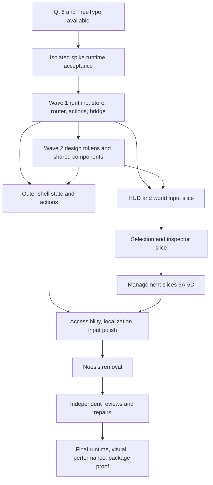

# Master RmlUi implementation plan

Status: **accepted discovery synthesis; implementation may begin only in the vertical slices and ownership boundaries below**  
Baseline: `https://github.com/rschurade/Ingnomia.git`, upstream default `master`, commit `4f99266c0f95faa847ca0db2af18cf59aff07f4b`, checkout date 2026-08-12  
Feature branch: `feat/rmlui-interface-rebuild`

## Decision summary

Ingnomia will replace its Noesis/XAML presentation with one RmlUi 6.2 context composited after the world renderer in the existing Qt-owned OpenGL 4.3 core context. Qt remains responsible for the native window, event loop, input method, cursor, clipboard, DPI, surface, context, and buffer swap. RmlUi owns layout, UI focus, UI pointer interaction, and UI rendering. The existing game-thread `EventConnector` and aggregators remain authoritative for simulation reads and mutations.

The migration is contract-first and vertical. RML binds only to copied typed presentation state in a GUI-thread `UiStore`; callbacks dispatch registered typed actions through a controller and queued Qt bridge. RML never owns game pointers, invokes game objects, parses CSS classes into actions, or rebuilds the whole document per frame.

The target experience is map-first: a shallow perimeter HUD, explicit build/tool state, one contextual dock, one coherent management workbench, overlay and modal stacks with deterministic focus, and a restrained basalt/slate/iron/bronze visual system. Unsupported data is omitted until a real producer and contract exist.

## Verified baseline

### Repository and prerequisites

- Remote: `https://github.com/rschurade/Ingnomia.git`.
- Default branch and baseline: `master` at tagged upstream commit `4f99266` (`v0.9.0`).
- Initial feature worktree: clean before discovery artifacts.
- Compiler discovery: MSVC 19.50 initializes successfully through Visual Studio 2026.
- CMake: 3.29.3.
- Baseline configure: reaches `find_package(Qt6)` and stops because `Qt6Config.cmake` is unavailable. No baseline build or runtime success is claimed.
- `.gitmodules` declares `src/base/beehive`, but baseline `HEAD` has no gitlink. The directly populated directory is prerequisite evidence only and must not be accidentally committed as a normal directory.
- Current required dependencies include Qt 6, OpenGL, Steam, Noesis, OpenAL, GLAD, fastnoise, and exprtk. RmlUi/FreeType replace the active Noesis dependency during migration.

### Current UI inventory

`01-current-ui-map.md`, `current-ui-map.json`, and the deterministic inventory establish:

- 23 player-facing or cross-cutting surfaces;
- 70 XAML documents, including 67 runtime content documents;
- 900 bindings, 332 command/event occurrences, and 151 visibility conditions;
- 2,474 resource keys and 62 templates;
- 283 Noesis include occurrences, 200 reflection macros, 607 reflected properties, and 39 registrations;
- 34 Qt UI bridge classes.

All migration rows remain `not_started`; discovery evidence is static and does not claim functional parity.

### Runtime and thread architecture

- `MainWindow` owns the `QWindow`, lazily created `QOpenGLContext`, frame scheduling, DPI/resize, and world-versus-UI input arbitration.
- `MainWindowRenderer` draws the world first. The UI overlays it and Qt swaps once.
- `GameManager` owns `EventConnector` and its aggregator children; the tree moves to the game thread.
- Current GUI models/proxies live on the GUI thread and receive queued copies. The replacement preserves this thread boundary.
- World lifecycle replaces the `Game` object. Every world-scoped DTO, pending action, selection, modal, and row is guarded by `WorldEpoch` and cleared before unload.

### Critical input invariants

Implementation and physical-input tests must deliberately cover:

- UI first refusal and pointer hit/consumption before world actions;
- click committed on release;
- world-origin camera drag after the 5-pixel threshold, even across UI;
- deterministic press/drag/release ownership across world/UI boundaries;
- right-click active-tool cancel without retained button state;
- GUI wheel precedence over world zoom/z-level;
- `Ctrl XOR toggleMouseWheel` world behavior;
- z-level bounds and Shift projection behavior;
- focused text/IME suppression of gameplay hotkeys;
- modal input blocking and focus trapping;
- logical Qt coordinates converted consistently to physical RmlUi/framebuffer pixels.

## Accepted architecture decisions

### Dependency ADR

Use RmlUi release 6.2 at immutable commit `2230d1a6e8e0848ed87a5761e2a5160b2a175ba4` through pinned `FetchContent`, with `FETCHCONTENT_SOURCE_DIR_RMLUI` documented for verified offline source. Pin FreeType separately. Link `RmlUi::Core`; make `RmlUi::Debugger` development-only. Compile the tagged official GL3 backend behind an Ingnomia adapter and use the existing GLAD loader.

The reference build is static for the first migration. Floating tags, `master`, copied Core sources, a required-only system package, and a second window-system backend are rejected.

### Qt/OpenGL ADR

Qt retains platform and presentation authority. Add custom Qt system, file, and input adapters plus a thin official-GL3 renderer adapter. Use one RmlUi context. RmlUi never creates a window/context or swaps buffers.

Context dimensions, injected pointer coordinates, clipping, and GL viewport use physical pixels. RML uses `dp`; density ratio is `devicePixelRatio * userScale`. Render order is queued state application, `Context::Update`, world render, RmlUi `BeginFrame/Render/EndFrame`, then one Qt swap.

The isolated `spikes/rmlui-qt-gl` source contract passes. Its runtime matrix remains blocked by missing Qt 6 and must be closed before production foundation acceptance.

## Target UI architecture

```text
game thread
  Game / managers
    -> EventConnector / aggregators
       -> pointer-free epoch + revision DTOs
          -> queued QtUiStateBridge

Qt GUI/render thread
  MainWindow
    -> UiInputRouter (gesture ownership)
    -> UiStore (typed copied state)
    -> UiRouter + ModalController
    -> UiController + UiActionRegistry
       -> queued QtUiCommandBridge -> aggregators
    -> RmlUiHost
       -> registered data models and documents
       -> Qt system/file/input adapters
       -> official GL3 renderer adapter
```

Layer rules:

1. Domain state remains authoritative on the game thread.
2. Bridge payloads are pointer-free, world-epoch scoped, and revisioned.
3. Presentation state is typed and copied; formatting/localization occurs on the GUI side.
4. RmlUi adapters expose only registered models, variables, transforms, and callbacks.
5. Actions use registered `ActionId` plus a closed typed payload variant and double validation.
6. Stable domain/composite IDs, never indices or translated names, identify list rows.
7. Ordinary changes dirty only affected variables or one affected collection per batch.
8. Navigation has one primary route, at most one workbench, at most one dock, an overlay stack, and a modal stack.

## Shared contracts frozen for implementation

The normative definitions live in `04-ui-data-contracts.md`. Screen agents may consume them but may not invent alternatives.

### Identifier and registry rules

- `RouteId`, `DocumentId`, `ActionId`, model names, `ToolId`, and catalog IDs are case-sensitive registered identifiers.
- Numeric domain IDs are paired with `WorldEpoch`.
- Prompt presentation identity is `PromptInstanceId`; optional nonzero domain response identity is `EventResponseTargetId`.
- Request IDs deduplicate non-idempotent actions.
- Absolute save paths never enter UI state.

### Canonical routes and composition

Use the exact route registry from section “Route IDs” of `04-ui-data-contracts.md`. The route families are:

- shell: main menu, new game, load, settings, loading;
- game primary: HUD;
- overlays: pause and settings;
- workbenches: population, jobs/professions, inventory, stockpiles, workshops/production, military, neighbors, debug;
- docks: build catalog, inspector, selection configuration.

Opening a workbench preserves world selection. Pause/settings overlays preserve the HUD below them. Only the top modal is interactive.

### Canonical document and asset roots

Use exact `DocumentId` mappings from `04-ui-data-contracts.md`, rooted beneath:

```text
content/rmlui/
  documents/
  screens/
  components/
  templates/
  styles/
  fonts/
  images/
  icons/
  localization/
```

No document may load an arbitrary filesystem path. Asset URLs are canonicalized beneath staged `content/rmlui`. A built-in `doc.error_fallback` must remain usable without external fonts or textures.

### Action contract

Use the exact action table and payload families from section “Typed actions and dispatch” of `04-ui-data-contracts.md`. Unknown IDs, wrong payload variants, stale epochs, invalid ranges, unavailable targets, and illegal route/modal contexts are rejected and visibly logged. UI may show pending state but may not optimistically mutate authoritative simulation state.

Legacy selection strings and misspelled domain seams may exist only in the bridge adapter. RML and shared state use typed tool/target/action enums.

### DTO, list, and dirtying contract

- All cross-thread DTOs contain values, stable IDs, localization keys, and asset descriptors—never `Game*`, `QObject*`, `QPixmap`, or aggregator-owned row pointers.
- Full snapshots occur on route entry or resynchronization. Subsequent updates use scalar changes or stable row insert/update/move/remove batches where practical.
- Each source stream carries `WorldEpoch` and monotonic revision. Stale epochs/revisions are discarded; gaps request resynchronization.
- Sort/filter changes preserve selection by stable ID. Removal chooses a deterministic adjacent focus target.
- `DirtyAllVariables`, per-frame blanket dirtying, document reload for ordinary updates, and wholesale DOM reconstruction are forbidden.

### Focus, modal, and input contract

- Focused text/IME and top modal receive input before global/gameplay commands.
- Modal uses a full input blocker and focus trap; background UI/world is inert.
- Escape order is IME composition, top dismissible modal, overlay, workbench/dock or active tool, then propagated game Escape.
- Required event prompts do not dismiss on Escape.
- Focus restores through `FocusToken`, with heading/first-action fallback.
- Losing window focus clears held camera/gesture/IME state without dispatching a domain cancel.

### Naming and visual contracts

- C++ types use `PascalCase`; fields use `camelCase`; RML variables use `snake_case`.
- CSS classes follow `c-` component, `l-` layout, `u-` utility, and explicit `is-` semantic-state conventions from `06-design-system.md`.
- Tokens use semantic dotted names in specification and centralized RCSS-compatible constants/generated values in implementation.
- Classes never encode route/action IDs or domain identity.
- Localization uses stable keys and typed arguments; visible English strings are not identity.

## Information architecture and visual direction

The player-facing specification is `05-ux-specification.md`; the normative visual grammar is `06-design-system.md`.

### Composition

- A shallow top rail exposes settlement pulse, time/season/year/daylight, z-level, pause/speed, and only contracted statuses.
- A compact tool entry and build dock keep placement visible.
- A right contextual inspector uses consistent sections for tiles, creatures, constructions, workshops, stockpiles, and agriculture.
- A bottom hint strip states active tool, click/right-click/drag/modifier behavior, cancel, and invalid reason when backed.
- Dense management work uses one coherent workbench with consistent navigation, search/filter/sort, stable selection, empty/loading/error states, keyboard alternatives, and locate-on-map.
- Routine information does not interrupt. Required event decisions and destructive confirmation use modals.

### Visual system

- Basalt/charcoal base; slate secondary surfaces; aged iron and bronze structure; warm amber focus; restrained mineral category accents.
- Cave identity comes from material hierarchy, edge rhythm, proportion, limited engraved detail, and modest motion—not rune body text, noisy textures, giant card grids, neon, or glow.
- Body text remains neutral and backed by readable surfaces. Texture is low-frequency, low-contrast, and removable in high-contrast/reduced-complexity modes.
- Focus and selection are visually independent. Severity always has text/icon/shape redundancy.
- Dense tables use rows and stable headers, not decorative cards.

### Unsupported-data gate

Do not surface a control or value until its producer, cost, update policy, identity, and action semantics are accepted. Current gated examples include general alert history, job diagnostics, workshop ETA/progress, stockpile limits not actually provided, favorites, keybinding editor, persisted accessibility preferences, and notification/auto-pause policy. The supported event prompt FIFO is not rebranded as a full alert system.

## Migration dependency graph



No screen conversion starts before Wave 1 runtime contracts and tests pass. No Noesis cleanup starts until replacement workflows pass their vertical gates.

## Vertical implementation slices and ownership

The orchestrator is sole owner of contract changes, root CMake integration order, cross-slice conflict resolution, and acceptance. Agents may edit only their assigned boundaries. Shared files are serialized through the orchestrator.

### Wave 1 — foundation

Owner: foundation agent. Exclusive implementation boundary:

- root/third-party CMake additions for pinned RmlUi/FreeType;
- `src/gui/ui/runtime/*`, `src/gui/ui/state/*`, `src/gui/ui/actions/*`, and bridge adapters;
- minimal `content/rmlui` smoke assets;
- focused non-rendering tests and isolated spike completion.

Required gate:

- real Qt/OpenGL/RmlUi initialization and clean shutdown;
- document/font/image/button/hover/focus/text/wheel/resize/scale/clipping proof;
- world and UI coexist without GL-state corruption;
- repeated document/context load/unload;
- registered route/modal/action/store tests;
- no screen-specific game logic in runtime.

### Wave 2 — design system and shared components

Owner: design-system implementation agent after foundation API freeze. Exclusive boundary:

- `content/rmlui/styles`, `components`, `templates`, common icons/fonts/images;
- asset/license manifest;
- component fixture documents and visual baselines.

Every RML/RCSS feature must be verified against pinned 6.2. Browser-only assumptions are rejected or implemented structurally. Shared components cover panel/window/title bar/toolbars/buttons/toggles/tabs/list/table/tree/scroll/select/text/numeric/slider/progress/badge/status/tooltip/popover/modal/alerts/empty/loading/key hints/context actions/inspector sections.

### Wave 3 — outer shell

Owner: outer-shell agent. Exclusive screen/controller boundary for menu, new/load/settings/loading/pause flows. Gate: keyboard and pointer navigation; real metadata only; new/load/start/pause/save/resume/return/exit paths; failure states; focus restoration; no world input during blocking transitions.

### Wave 4 — HUD and world tools

Owner: HUD agent. Boundary for global rail, clock/z/pause/speed, overlays/watch state, build/designation UI, hint strip, and event prompt. Gate: real state/action mutations plus physical map click-through/consumption, placement/cancel, drag/wheel/right-click, and event response proof.

### Wave 5 — selection and inspector

Owner: inspector agent. Boundary for tile/creature/construction/workshop/stockpile/agriculture selection views, selection configuration, contextual actions, and locate behavior. Gate: each supported target refreshes, mutates through typed actions, survives deselection/world unload, and never leaks UI clicks into world commands.

### Wave 6 — management

Parallel work begins only after shared workbench/table/tree APIs freeze.

- 6A owns workshops, production, stockpiles, and agriculture.
- 6B owns population, professions/work assignments, inventory/resources, and creature detail.
- 6C owns military, neighbors/diplomacy, selection management, and backed reports/events.
- 6D owns debug UI, diagnostics, update/dirty instrumentation, and developer overlays.

Each owner has separate screen/controller/test files. Shared store/action/runtime/component files remain orchestrator-owned. Gates include real mutations, stable selection through sort/filter/patches, keyboard alternatives, large-list behavior, error/empty/loading states, and save/reload where relevant.

### Wave 7 — accessibility, localization, and input polish

Owner: accessibility/input agent. Boundary includes focus graph, spatial navigation, key conflicts, clipboard/IME/Unicode, tooltip access, contrast/reduced motion, scale/text behavior, localization resources and long-string fixtures. No dead settings rows may be exposed.

### Wave 8 — Noesis removal

Owner: cleanup agent after replacement parity acceptance. Remove active Noesis/NoesisApp build, license, DLL deployment, resource providers, reflection/commands/strings/collections/images/page classes, XAML/theme content, Blend/sample support, converters, headers, scripts, and CI secrets. Every remaining search hit is reviewed and justified. Preserve unrelated Qt/dependencies and licensing obligations.

### Wave 9 — independent review and repair

Use four fresh reviewers for architecture/lifetime, UX/accessibility, rendering/performance/input, and functional parity. Reviewers do not accept their own implementation. Every fixable finding is assigned, repaired, and retested.

## Integration and rollback strategy

- Keep slices small and reviewable. Record a clean status and file boundary before each agent starts.
- Integrate one vertical slice at a time; run static checks, focused tests, configure/build, and available runtime smoke after each batch.
- Do not mix dependency/runtime, screen, asset, cleanup, and unrelated gameplay changes in one patch.
- Rollback points are the accepted baseline, foundation runtime, shared design system, outer shell, HUD/input, inspector, each management group, accessibility pass, and Noesis-removal pass.
- If a slice fails, revert only its isolated patch/commit or disable its route behind the registry; do not reset the worktree or erase unrelated work.
- Contract changes require orchestrator review, affected-owner notification, registry/test updates, and revalidation of downstream slices.

## Test strategy

### Static and unit tests

- registry uniqueness and missing registration failures;
- route, workbench, dock, overlay, and modal stacks;
- action payload/epoch/range validation and dispatch results;
- epoch reset, revision ordering, gap resync, and pending-action invalidation;
- stable row insert/update/move/remove and selection/focus preservation;
- scalar/collection dirtying boundaries;
- settings schema conversion and unsupported-row omission;
- sorting/filtering, alert/event ordering, missing data, localization lookup, and UTF-8 round trips;
- RML ID uniqueness, callback/model/action registration, logical asset paths, and unsupported feature audit.

### Runtime and functional tests

Exercise launch, menu, continue, new/load/settings, save/pause/resume/exit/return, camera pan/drag/zoom/rotate/z, tile/creature selection, right click, build/mining/material/cancel, stockpile/workshop/agriculture/population/inventory/military/neighbors, prompts, watch/overlay controls, speed/pause/hotkeys/scale/fullscreen, world reload, and repeated screen cycles.

Every workflow is either passed, deliberately replaced with a tested superior workflow, or remains incomplete. Structural presence is not parity.

### Lifecycle tests

- repeated application start/close;
- repeated context/document load/unload;
- new/load/end/return cycles with epoch reset;
- process exits within a bounded interval without forced termination;
- all GPU/document/model/Qt connections released;
- missing document/font/image and malformed action produce usable failure state.

## Visual-validation strategy

Capture the literal running framebuffer at 1280x720, 1600x900, 1920x1080, 2560x1440, and 3440x1440 with relevant 80/100/125/150/200% scales. Include 1280x720 at 200% and ultrawide at 100/150%.

For each major route/state validate clipping, overlap, off-screen dialogs, target size, icon aspect, close/back visibility, tooltip clamp, focus/selection distinction, text/world contrast, map obstruction, empty/loading/error/disabled states, long localization strings, high contrast, reduced motion, and modal/input blocking. Store repeatable capture commands, machine/build/resolution/scale metadata, and final hashes. Static RML screenshots do not replace the real app framebuffer.

## Performance strategy

- Measure before/after on the same machine, build, scene, resolution, scale, and method.
- Instrument UI update, layout, render, DTO projection, collection churn, document count, geometry, textures, Qt connections, and memory across long runs and world reloads.
- No expensive domain/DB query occurs in render callbacks.
- Population, inventory, catalog, workshop, stockpile, and trade views use entry snapshots plus stable patches or measured bounded pagination/incremental population.
- Investigate meaningful world frame-time or memory regression; do not invent thresholds or numbers before measurement.
- Development debugger/hot reload is compiled out or dormant in release.

## Accessibility and localization strategy

- All workflows have keyboard alternatives; visible focus and logical order are mandatory.
- Text input separates physical keys, committed UTF-8, and IME composition.
- Status never depends on color alone. High contrast removes texture and strengthens structure; reduced motion removes travel/parallax.
- UI/text scaling preserves stable selection and focus through reflow.
- Player strings use centralized keys and typed arguments; stable IDs are never translated.
- Long strings, missing glyphs/keys, plural/value formatting, and locale changes require fixtures.
- RmlUi/OS accessibility and announcement capability must be proven. Do not claim ARIA or screen-reader support merely from RML attributes.

## Noesis-removal strategy

Replacement proceeds alongside current UI only as a temporary, explicit integration state. Once every migration row has runtime parity evidence:

1. remove Noesis/NoesisApp targets and license configuration;
2. remove runtime DLL/provider/view/render code;
3. remove Noesis-specific models/proxies after their bridge responsibilities are replaced;
4. remove XAML, themes, Blend/sample data, converters, and obsolete assets;
5. update build, packaging, CI, developer setup, dependency docs, and notices;
6. run the complete case-insensitive Noesis/XAML audit;
7. review and justify every remaining historical/documentation result;
8. build/package/run the literal final artifact without license secrets or Noesis binaries.

## Risk register

| Risk | Impact | Mitigation / gate |
|---|---|---|
| Qt 6 unavailable | blocks baseline and spike runtime | install/provide supported Qt 6; rerun spike before foundation acceptance |
| malformed upstream beehive submodule declaration | non-reproducible checkout/accidental nested repo | document exact prerequisite; resolve separately without committing nested `.git` |
| input-consumption inversion/cross-boundary state | world mutations or stuck buttons | normalized adapter result + gesture state machine + physical tests |
| GL state leakage | corrupt world/UI rendering | explicit state snapshot tests and adapter restoration |
| DPI unit mismatch | wrong hit tests/clipping/scale | physical-pixel contract + multi-scale/monitor proof |
| stale world pointers/updates | crashes or wrong-world commands | pointer-free DTOs, epochs, revisions, unload protocol |
| expensive snapshots/list churn | frame-time/memory regression | entry snapshots, patches, stable IDs, profiling/instrumentation |
| RmlUi browser-feature assumptions | broken layout/styles | pinned-doc/source verification and component fixtures |
| fabricated/unsupported UI data | misleading player interface | useful-data contract gate and omitted controls |
| incomplete localization/settings backing | dead or inconsistent UI | schema repair and runtime round-trip before exposure |
| modal/focus ambiguity | inaccessible or unsafe input | one stack, full blocker, focus tests, deterministic Escape |
| shutdown/lifecycle hang | unshippable process behavior | bounded repeated close/world-unload tests; no forced-exit workaround |
| premature Noesis deletion | lost workflows | remove only after row-by-row parity evidence |
| visual theme overwhelms data | poor readability | semantic tokens, texture limits, contrast/framebuffer review |
| platform claims exceed evidence | false completion | report each platform/build/runtime proof separately |

## Acceptance gates by evidence level

1. **Source/static:** registries, contracts, inventories, RML/RCSS audit, license manifest.
2. **Configure/build:** reproducible dependency resolution and Debug/RelWithDebInfo build for each claimed platform.
3. **Focused tests:** unit/static/bridge/route/action/state tests pass.
4. **Native startup:** exact built executable opens a responsive Qt/OpenGL/RmlUi window.
5. **Physical interaction:** real keyboard/mouse/IME/world/UI routing and state-changing commands pass.
6. **Persistence/lifecycle:** save/reload/world replacement/repeated close and clean process exit pass.
7. **Visual:** literal framebuffer matrix and accessibility variants inspected.
8. **Performance:** representative scene/list measurements and long-run resource evidence recorded.
9. **Package:** final deployable artifact runs without Noesis/license secrets and contains correct notices.

Passing an earlier level never implies a later level.

## Definition of done

The migration is done only when:

- all 23 current-map rows have runtime parity or an explicitly tested superior replacement;
- every applicable acceptance checkbox in `plan.md` has direct evidence;
- RmlUi owns all player-facing title/menu/HUD/dialog/management UI;
- typed state/action, stable identity, narrow dirtying, focus/modal, lifecycle, and input contracts pass;
- the complete resolution/scale/accessibility visual matrix is inspected;
- representative performance and resource-lifetime evidence is recorded;
- Noesis is absent from active source/build/runtime/content/deployment and no license secret is required;
- Windows and any other claimed platform build/run evidence is literal and current;
- four independent reviews are complete and all fixable findings are repaired;
- `08-test-and-validation-report.md`, `09-final-migration-report.md`, screenshot gallery, build/dependency/license docs, and machine-readable migration status are current;
- the final report says clearly whether every criterion passed and lists only genuine external limitations.

Current status: discovery and synthesis are complete. Implementation, runtime spike proof, parity, visual, performance, lifecycle, cleanup, and final-package gates remain open.
